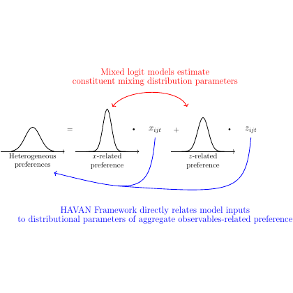

# test_4.png



以下为针对所给科研绘图的 LaTeX/TikZ 重构指导。内容力求不臆造，仅基于可见版式与要素进行可操作复刻，少量尺寸与色值为合理近似，可按需要微调。

1) 概览
- 图形类型与构图
  - 概念性示意图，核心为“一个异质偏好分布 = 两个可观测相关偏好分布之和（带自变量标注）”。
  - 横向三栏：左/中/右分别为三条“钟形分布”草图（非坐标图，不含坐标轴数值），下方各自有说明文字。
  - 中间与右侧上方各有一个实心小圆点，旁标数学变量 x_{ijt}, z_{ijt}。
- 关系与标注
  - 左分布与中分布之间放置“=”，中与右之间放置“+”。
  - 图顶红色两行标题文字，并由红色弧形箭头指向上方的两个黑点（可用两条弧线箭头实现）。
  - 图底蓝色两行说明文字，从该文字延伸两条长弧形蓝色箭头分别指向左、右两个分布（U 形走向）。

2) 文档骨架与依赖
- 文档类：standalone（便于独立编译并嵌入论文/幻灯片）。
- 核心宏包：tikz, xcolor, amsmath（数学变量排版）。
- TikZ 库
  - arrows.meta（箭头样式）
  - positioning（节点相对定位）
  - calc（曲线控制点便于微调）
  - 可选：decorations.pathmorphing 不需要；若改用坐标图绘制正态曲线，可选 pgfplots。

3) 版面与画布设置
- 建议画布尺寸：约宽 12–13 cm，高 9–10 cm（接近原图留白比例）。
- 内部坐标范围（TikZ 自定义）：x ∈ [-6.5, 6.5]，y ∈ [-3.0, 4.3]。三组分布中心大致位于 x ≈ -4, 0, +4，基线 y=0。
- 纵横比：接近 1:1（方形画布，便于在幻灯片居中）。
- 节点间距与对齐
  - 三个“分布小面板”水平等距对齐（中心相隔约 4 个单位）。
  - “=”“+”放在 y≈0.9–1.1，位于相邻面板之间的中点。
  - 顶部红字中心居中于整体，y≈3.4–3.6。
  - 底部蓝字居中于整体，y≈-2.1 至 -2.3。
- \tikzpicture 参数建议
  - \begin{tikzpicture}[x=0.9cm,y=0.9cm,line cap=round,line join=round]
  - 用 x/y 尺度统一控制整体缩放；line cap/line join 改善曲线与箭头的观感。

4) 字体与配色
- 字体
  - 默认为 Computer Modern：正文标签与数学变量混排效果佳。
  - 尺寸建议：
    - 主体标签（面板说明、x_{ijt}, z_{ijt}）：\footnotesize–\normalsize
    - 顶部红色标题与底部蓝色说明：\small（两行）
- 颜色（近似值，可按品牌色调整）
  - 黑色（线条与分布）：black
  - 红色（顶部标题与其箭头）：brandred = RGB(204,0,0) 或 HTML #CC0000
  - 蓝色（底部说明与其箭头）：brandblue = RGB(0,0,170) 或 HTML #0000AA
- 渐变/透明度/阴影：无明显使用。若需淡化非关键元素，可用 draw opacity=<0–1> 或 text opacity。

5) 结构与组件样式
- 节点
  - 分布草图由一条平滑钟形曲线与一条水平基线箭头组成；下方两行说明文字居中对齐（如 “Heterogeneous preferences” 等）。
  - 黑点：小实心圆（circle, fill, inner sep≈1–1.2pt），其上方或右上方放置数学变量标签。
- 边与箭头
  - 箭头样式：-{Stealth[length=3mm]}，线宽 0.8pt（主导视线）。
  - 蓝色下部箭头：长弧线，两条分别从蓝色说明文字的左右侧向上弯向左、右面板（U 形），形成“自下而上关联”。
  - 红色顶部箭头：两条短弧形箭头，从红色标题下方弯向两个黑点。
- 坐标轴与网格线：无坐标轴。分布下的水平线仅作基线并向右加箭头。

6) 数学/表格/图形细节
- 数学排版
  - 在节点文本中直接用 $x_{ijt}$、$z_{ijt}$。
- 分布曲线绘制
  - 直接用 TikZ plot 绘制简化“正态形”曲线即可；曲线仅示意，无需精确参数。
  - 核心片段（TikZ 原生）：
    \draw[line width=0.8pt]
      plot[domain=-0.9:0.9,samples=120]
        (\x,{1.1*exp(-(\x*\x)/0.32)});
- 可选 PGFPlots 方案（若更偏好函数绘制）
  - 使用 axis[hide axis, width=..., height=...] 后 \addplot[domain=...,samples=...] {exp(-x^2/...)};
  - 但本图并无刻度与框线，TikZ 原生更轻量。

7) 自定义宏与命令
- 推荐封装样式，便于复用与统一风格：
  - TikZ 样式
    - flowarrow/.style={-{Stealth[length=3mm]},line width=0.8pt}
    - axisarrow/.style={-Stealth,line width=0.5pt}
    - bell/.style={line width=0.8pt}
    - caption/.style={font=\footnotesize,align=center}
    - dot/.style={circle,fill,inner sep=1.2pt}
  - 小面板命令（位置、标题、缩放）
    - \PreferencePanel{<x>}{<两行说明>}{<scale>}
      - 在 x 位置处绘制一条基线和一条钟形曲线，并在下方居中放置说明文本。

8) 最小可运行示例 (MWE)
```latex
\documentclass[border=3pt]{standalone}
\usepackage{tikz}
\usepackage{amsmath}
\usetikzlibrary{arrows.meta,calc,positioning}

\definecolor{brandred}{RGB}{204,0,0}
\definecolor{brandblue}{RGB}{0,0,170}

\tikzset{
  flowarrow/.style={-{Stealth[length=3mm]},line width=0.8pt},
  axisarrow/.style={-Stealth,line width=0.5pt},
  bell/.style={line width=0.8pt},
  caption/.style={font=\footnotesize,align=center},
  dot/.style={circle,fill,inner sep=1.2pt}
}

% 一个简化的“分布小面板”命令：在 x=<#1> 处绘制曲线和说明文字
\newcommand{\PreferencePanel}[3]{%
  \begin{scope}[shift={(#1,0)},scale=#3]
    % 基线（示意坐标轴，向右箭头）
    \draw[axisarrow] (-1.2,0) -- (1.6,0);
    % 钟形曲线（示意）
    \draw[bell]
      plot[domain=-0.95:0.95,samples=140]
        (\x,{1.05*exp(-(\x*\x)/0.32)});
    % 下方说明
    \node[caption] at (0,-0.65) {#2};
  \end{scope}%
}

\begin{document}
\begin{tikzpicture}[x=0.9cm,y=0.9cm,line cap=round,line join=round]
  % 三个分布面板
  \PreferencePanel{-4}{Heterogeneous\\preferences}{1.0}
  \PreferencePanel{0}{x-related\\preference}{1.0}
  \PreferencePanel{4}{z-related\\preference}{1.0}

  % 等号与加号（高度略高于曲线峰）
  \node at (-2,1.05) {$=$};
  \node at ( 2,1.05) {$+$};

  % 黑点与变量标签（位于中、右面板上方）
  \node[dot] (xpt) at (0,1.50) {};
  \node[above=2pt of xpt] {$x_{ijt}$};
  \node[dot] (zpt) at (4,1.50) {};
  \node[above=2pt of zpt] {$z_{ijt}$};

  % 顶部红色标题
  \node[text=brandred,align=center] (toptext) at (0,3.45)
    {Mixed logit models estimate\\
     constituent mixing distribution parameters};

  % 从顶部文字到两个黑点的红色弧线箭头
  \draw[flowarrow,draw=brandred]
    (toptext.south) to[bend left=22] (xpt.north);
  \draw[flowarrow,draw=brandred]
    (toptext.south) to[bend right=22] (zpt.north);

  % 底部蓝色说明
  \node[text=brandblue,align=center,font=\small] (bottomtext) at (0,-2.20)
    {HAVAN Framework directly relates model inputs\\
     to distributional parameters of aggregate observables-related preference};

  % 从底部说明到左右面板的长弧形蓝色箭头（U 形）
  \coordinate (L) at (-4.2,0.25);
  \coordinate (R) at ( 4.2,0.25);
  \draw[flowarrow,draw=brandblue]
    ([xshift=-1.5cm]bottomtext.north) .. controls (-3.6,-1.2) and (-5.0,-0.6) .. (L);
  \draw[flowarrow,draw=brandblue]
    ([xshift= 1.5cm]bottomtext.north) .. controls ( 3.6,-1.2) and ( 5.0,-0.6) .. (R);
\end{tikzpicture}
\end{document}
```

9) 复刻检查清单
- 图形尺寸与坐标范围
  - 画布约 12–13 cm 宽；x=±6.5、y≈[-3,4.3] 可覆盖所有元素。
- 节点/边样式
  - 钟形曲线线宽 0.8 pt；基线细一些（0.5 pt）。
  - 黑点为实心小圆，inner sep≈1.2 pt。
  - 箭头均为 Stealth，顶部箭头为短弧，底部为长弧（U 形）。
- 字体与字号
  - 面板说明 \footnotesize；上下说明 \small；数学变量为常规数学模式。
- 配色与线型
  - 红 #CC0000；蓝 #0000AA；曲线与文本黑色。
  - 线条无虚线/阴影/透明度（除非另需强调）。
- 特殊效果
  - 无渐变与阴影；仅平滑曲线与弧形箭头。
- 与原图的差异点（可能需要微调）
  - 弧线箭头的弯曲程度与箭头长度；
  - 三条钟形曲线的高度/宽度比例；
  - 文本换行点与行距；
  - 精确色值与字号。

10) 风险与替代方案
- 不确定因素
  - 原图未提供精确色值、字体与相对尺寸；上例使用近似值与默认 Computer Modern。
  - 钟形曲线仅为示意函数（非拟合原图），需要时可调整 domain 与指数分母常数以改变“胖瘦/高度”。
- 替代方案
  - 字体：若论文统一 Times 系，可改用 newtxtext/newtxmath 或 newpxtext/newpxmath。
  - 颜色：若需更深/更浅，可把 brandred/brandblue 改为 xcolor 的 HTML 值（如 #D00000、#0033CC）。
  - 曲线绘制：如需在相同风格下精确控制，可用 PGFPlots 的 hide axis + \addplot 正态函数；或直接改为手绘样条（.. controls ..）达到完全形状一致。
  - 箭头：若需要更尖锐或更圆润的箭头，可把 Stealth 改为 Latex 或 Triangle，并调整 length。

按上述 MWE 编译即可得到与目标图相近的排版与布局。后续仅需微调控制点、位置与字号，即可实现高保真复刻。
