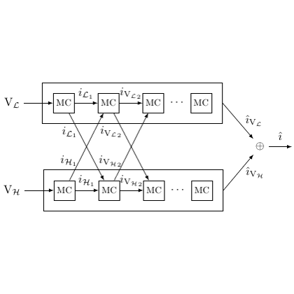

# test_9.png



以下为针对给定科研绘图的 LaTeX/TikZ 重构指导。为避免臆造具体符号，我在含糊之处使用占位/示例变量名（如 i_{L1}, i_{H1}, hat v_L, hat v_H 等），你可在源码中直接替换为论文实际记号。

1) 概览
- 图形类型与构图
  - 类型：模块/信号流框图（两条并行“通道”或“流水线”，每条通道内是若干相同方块模块 MC）。
  - 布局：上下两行的长矩形容器（表示两组集合/空间或通道），每行内有多个小方块“MC”从左到右排列，中间用省略号表示更多单元；左右方向为信号流向。
  - 主要元素关系：
    - 左侧两条输入箭头分别进入上、下通道的首个 MC。
    - 同一行内相邻 MC 间有前向箭头。
    - 上下两行首、次级 MC 之间存在交叉的对角箭头（上1→下2、下1→上2）。
    - 最右端，上、下通道各自输出箭头汇入一个带“⊕”的求和结点，右侧输出单一直箭头。
  - 标注：各箭头旁均有斜体数学标注（如 i_{L1}, i_{H1}, i_{V L2}, i_{V H2} 等）；两行容器左侧各自带标签 V_𝓛 与 V_𝓗；两路输出分别标注 hat v_𝓛、hat v_𝓗，合成后为 hat i。

2) 文档骨架与依赖
- 文档类：standalone（便于单文件编译、直接生成图）
- 宏包与库
  - tikz, amsmath, amssymb, xcolor
  - TikZ 库：arrows.meta（现代箭头）、positioning（相对定位）、calc（坐标计算）、fit（围合成组画“容器”）、backgrounds（背景层，若需）、shapes.misc（和 sum 节点配合）
- 编译建议：pdflatex 或 lualatex 均可

3) 版面与画布设置
- 建议整体尺寸：宽度约 9–10 cm；高度约 5–6 cm（可随文稿栏宽调整）
- 坐标与间距（可在样式中集中调控）
  - 横向模块间距：14–16 mm
  - 两行（上下容器）垂直间距：15–18 mm
  - 容器内边距（fit 的 inner sep）：2.5–3.5 mm
  - 右侧求和结点距最右 MC：16–20 mm
- 对齐方式：两行 MC 列对齐；求和结点与上、下行右端在竖直方向大致居中
- tikzpicture 参数建议
  - font=\small（或 \footnotesize）、>=Stealth、line cap=round、line join=round
  - 统一坐标缩放：可用 node distance 管理相对间距

4) 字体与配色
- 字体
  - 数学标注与节点文本：默认 Computer Modern（或根据论文改为 Times/Libertinus）
  - 字号：\small 或 \footnotesize；图中文字尽量与正文一致
- 配色
  - 主色：黑色（线条、文字）
  - 辅助：MC 方块可保持白底黑框；若需区分，可轻微灰框（HTML #666666）或 50% 灰填充很淡（不建议过深，以免抢占视觉）
- 透明/阴影/渐变：原图无渐变、阴影与透明度；保持纯线框风格

5) 结构与组件样式
- 节点
  - MC：小矩形，白底，黑框，内写“MC”；大小约 6×6 mm
  - 容器：细线矩形，用 fit 围合一行所有 MC 与省略号；左侧加 label=left: 的数学标签 V_𝓛 / V_𝓗
  - 求和结点：小圆，内置“⊕”
  - 省略号：节点文本“⋯”
- 边与箭头
  - 线宽 0.6 pt；箭头样式 -Stealth
  - 同行前向连线：直线箭头
  - 交叉连线：自上1 → 下2、下1 → 上2，直线或微弯曲；为避免与前向线重叠，可保持轻微错位或在标注处加白底
- 标签
  - 箭头中点处加数学标注 node[midway, <pos>, fill=white, inner sep=1pt]
  - 输出端上、下两路分别标注 hat v_𝓛、hat v_𝓗；合成输出标注 hat i

6) 数学/表格/图形细节
- 公式排版
  - 在 TikZ 节点内使用 $...$；统一字体用 font=\small 控制
- 本图不含坐标轴/表格/PGFPlots；核心为 TikZ 矩形、箭头与 fit 容器

7) 自定义宏与命令（复用样式）
- 颜色与样式集中定义，便于全局微调：
  - mc/.style={draw, rectangle, minimum width=6mm, minimum height=6mm, inner sep=0pt}
  - bus/.style={draw, rectangle, inner sep=3mm}
  - line/.style={-Stealth, line width=0.6pt}
  - sum/.style={draw, circle, inner sep=0pt, minimum size=9pt}
  - lab/.style={fill=white, inner sep=1pt}
- 记号占位：
  - \newcommand{\vL}{V_{\mathcal L}}, \newcommand{\vH}{V_{\mathcal H}}
  - \newcommand{\vhatL}{\hat{v}_{\mathcal L}}, \newcommand{\vhatH}{\hat{v}_{\mathcal H}}, \newcommand{\ihat}{\hat{\imath}}

8) 最小可运行示例 (MWE)
- 该示例严格还原布局和风格；把占位标注替换为你的实际符号即可。

```latex
\documentclass[tikz,border=2pt]{standalone}
\usepackage{amsmath,amssymb}
\usepackage{xcolor}
\usetikzlibrary{arrows.meta,positioning,calc,fit,backgrounds,shapes.misc}

% ------- styles & macros -------
\tikzset{
  line/.style={-Stealth, line width=0.6pt},
  mc/.style={draw, rectangle, minimum width=6mm, minimum height=6mm, inner sep=0pt},
  bus/.style={draw, rectangle, inner sep=3mm},
  sum/.style={draw, circle, inner sep=0pt, minimum size=9pt},
  lab/.style={fill=white, inner sep=1pt}
}
\newcommand{\vL}{V_{\mathcal L}}
\newcommand{\vH}{V_{\mathcal H}}
\newcommand{\vhatL}{\hat{v}_{\mathcal L}}
\newcommand{\vhatH}{\hat{v}_{\mathcal H}}
\newcommand{\ihat}{\hat{\imath}}

\begin{document}
\begin{tikzpicture}[font=\small, >=Stealth, node distance=14mm, line cap=round, line join=round]

  % ---- top row MCs ----
  \node[mc] (t1) {MC};
  \node[mc, right=14mm of t1] (t2) {MC};
  \node[right=12mm of t2] (tdots) {$\cdots$};
  \node[mc, right=12mm of tdots] (t4) {MC};

  % ---- bottom row MCs ----
  \node[mc, below=16mm of t1] (b1) {MC};
  \node[mc, right=14mm of b1] (b2) {MC};
  \node[right=12mm of b2] (bdots) {$\cdots$};
  \node[mc, right=12mm of bdots] (b4) {MC};

  % ---- containers (fit) with left labels ----
  \node[bus, fit=(t1)(t2)(tdots)(t4), label={[xshift=-6mm]left:$\vL$}] (busL) {};
  \node[bus, fit=(b1)(b2)(bdots)(b4), label={[xshift=-6mm]left:$\vH$}] (busH) {};

  % ---- left inputs to first MCs ----
  \coordinate (L_in) at ($(busL.west)+(-8mm,0)$);
  \coordinate (H_in) at ($(busH.west)+(-8mm,0)$);
  \draw[line] (L_in) -- (t1.west)
      node[midway, below, lab] {$i_{\mathcal L 1}$}; % 替换为你的实际符号
  \draw[line] (H_in) -- (b1.west)
      node[midway, above, lab] {$i_{\mathcal H 1}$};

  % ---- forward links within rows ----
  \draw[line] (t1.east) -- (t2.west);
  \draw[line] (b1.east) -- (b2.west);
  % 通过省略号的连线（分两段以避开“⋯”节点）
  \draw[line] (t2.east) -- ($(tdots.east)+(2mm,0)$);
  \draw[line] ($(bdots.east)+(2mm,0)$) -- (b4.west);
  \draw[line] (t2.east) ++(0,0) -- ++(0,0); % 占位，易于对齐
  \draw[line] (b2.east) -- ($(bdots.east)+(2mm,0)$);
  \draw[line] ($(tdots.east)+(2mm,0)$) -- (t4.west);

  % ---- cross links (diagonals) ----
  \draw[line] (t1.south) -- (b2.north)
      node[midway, right, lab] {$i_{V\mathcal{H}2}$}; % 占位
  \draw[line] (b1.north) -- (t2.south)
      node[midway, left, lab] {$i_{V\mathcal{L}2}$};  % 占位

  % ---- outputs to adder ----
  \node[sum, right=18mm of t4] (adder) {$\oplus$};
  \draw[line] (t4.east) -- (adder.west)
      node[midway, above, lab] {$\vhatL$}; % 占位
  \draw[line] (b4.east) -- (adder.west)
      node[midway, below, lab] {$\vhatH$}; % 占位
  \draw[line] (adder.east) -- ++(12mm,0) node[right] {$\ihat$}; % 合成输出

\end{tikzpicture}
\end{document}
```

9) 复刻检查清单
- 图形尺寸与范围
  - 整体宽度是否接近列宽（约 9–10 cm）？上下两行间距是否与原图一致？
- 节点/边样式
  - MC 方块大小、容器边框粗细、sum 结点大小与“⊕”是否清晰
  - 箭头线宽 0.6 pt、-Stealth 头型，交叉连线角度与位置是否合适
- 字体与字号
  - 文本字号统一（\small/正文字号）；数学斜体是否正常
- 配色与线型
  - 纯黑线条；若使用灰度，是否不影响可读性
- 特殊效果
  - 无渐变/阴影；交叉处标注用白底遮挡避免重叠
- 与原图差异点
  - 省略号位置与数量、MC 个数、精确的箭头标签文本可能与原图略有出入（请按论文符号替换）
  - 容器是否需要圆角、双线边框（原图看起来为直角单线；如需要可加 rounded corners）

10) 风险与替代方案
- 不确定因素
  - 精确的字体与字号：若论文统一使用 Times/新罗马，请在导言中加载 newtxtext/newtxmath 或使用 \usepackage{times}（不推荐）后统一。
  - 精确色值：原图为黑白；若稿件要求彩色，可酌情引入少量灰阶或主题色。
  - 标签精确内容：示例中用占位符；请按原文献中符号替换。
- 替代方案
  - 字体：默认 Computer Modern → 替换为 Times/Libertinus
  - 箭头库：arrows.meta → 若需更细箭头可用 Latex/Latex'；或更粗可用 Stealth[scale=1.2]
  - 容器绘制：fit → 也可用手工坐标画 rectangle 并手调 padding
  - 交叉连线：若与前向线重叠严重，可用 bend left/bend right 或 out/in 弯曲参数轻微避让

说明
- 以上 MWE 已包含所有关键构件与样式；你只需替换占位数学标签、微调间距（node distance、right=...、below=...）及线宽即可达到与目标图等效的版式。
