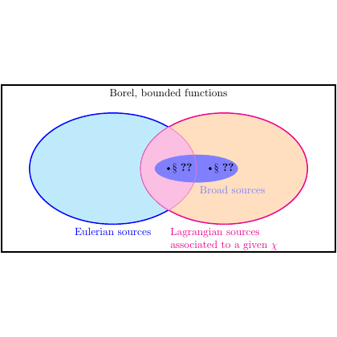

# test_0.png



# 1. Overview
The image shows a Venn diagram illustrating the relationship between Borel bounded functions, with two overlapping ellipses representing "Eulerian sources" and "Lagrangian sources associated to a given γ". The intersection contains "Broad sources" with mathematical symbols "$s^{??}$" and "$s_*^{??}$".

# 2. Document Skeleton & Dependencies
```latex
\documentclass{article}
\usepackage{tikz}
\usepackage{xcolor}
\usepackage{amsmath}
\usepackage{amssymb}
```

# 3. Layout & Canvas Settings
```latex
\begin{tikzpicture}[scale=1.0]
  % Content will be placed here
\end{tikzpicture}
```

# 4. Fonts & Colors
```latex
\definecolor{lightblue}{RGB}{204,229,255}
\definecolor{lightpink}{RGB}{255,204,229}
\definecolor{lightorange}{RGB}{255,229,204}
\definecolor{blue}{RGB}{0,0,255}
\definecolor{magenta}{RGB}{255,0,128}
```

# 5. Structure & Component Styles
- Outer rectangle: Black border, white fill
- Left ellipse: Blue border, light blue fill, 70% opacity
- Right ellipse: Magenta border, light pink fill, 70% opacity
- Intersection: Purple-blue region with light purple fill
- Text labels positioned beneath and inside ellipses

# 6. Math/Table/Graphic Details
- Mathematical notation: "$s^{??}$" and "$s_*^{??}$" in the intersection
- Greek letter γ (gamma) in the right ellipse label

# 7. Custom Macros & Commands
```latex
\tikzset{
  venn circle/.style={draw, ellipse, minimum width=4cm, minimum height=3cm, opacity=0.7},
  title text/.style={font=\bfseries}
}
```

# 8. MWE (Minimum Working Example)
```latex
\documentclass{article}
\usepackage{tikz}
\usetikzlibrary{shapes,positioning,calc}

\begin{document}

\begin{tikzpicture}
  % Define colors
  \definecolor{lightblue}{RGB}{204,229,255}
  \definecolor{lightpink}{RGB}{255,204,229}
  \definecolor{lightorange}{RGB}{255,229,204}
  
  % Draw the outer rectangle
  \draw[thick] (-5,-2.5) rectangle (5,2.5);
  
  % Title
  \node[font=\bfseries] at (0,2) {Borel, bounded functions};
  
  % Draw the left ellipse (Eulerian sources)
  \filldraw[draw=blue, fill=lightblue, opacity=0.7] (-1.5,0) ellipse (2.5cm and 1.7cm);
  
  % Draw the right ellipse (Lagrangian sources)
  \filldraw[draw=magenta, fill=lightpink, opacity=0.7] (1.5,0) ellipse (2.5cm and 1.7cm);
  
  % Add the intersection fill (slightly darker)
  \filldraw[fill=lightorange, opacity=0.7] (0,0) ellipse (1cm and 0.7cm);
  
  % Add labels
  \node[blue] at (-2.2,-1.5) {Eulerian sources};
  \node[magenta, align=center] at (2.2,-1.5) {Lagrangian sources\\associated to a given $\gamma$};
  
  % Add the text in the intersection
  \node at (-0.3,0) {$s^{??}$};
  \node at (0.3,0) {$s_*^{??}$};
  \node[blue!60] at (0,-0.5) {Broad sources};
\end{tikzpicture}

\end{document}
```

# 9. Replication Checklist
- [ ] Two overlapping ellipses with proper colors (blue/pink)
- [ ] Correct labels for Eulerian and Lagrangian sources
- [ ] Mathematical notation in the intersection
- [ ] "Broad sources" label in the intersection
- [ ] Outer rectangle with title
- [ ] Proper opacity and color blending in overlapping region

# 10. Risks & Alternatives
- Exact color matching may vary between PDF viewers
- Font sizes might need adjustment based on document class
- Alternative implementation could use the `venn` package for more precise control
- The "??" symbols might need adjustment - they appear to be question marks in the original
- The exact positioning of elements may require fine-tuning
