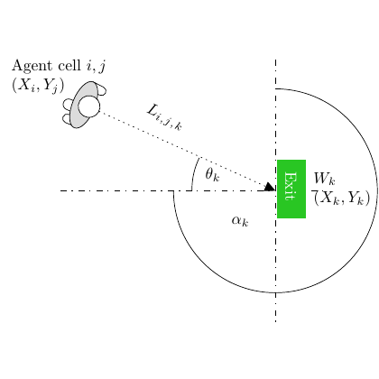

# test_101.png



# 1. Overview
The image shows a diagram of an agent-based model with two main components: an "Agent cell i,j" on the left represented by a gray circular structure with coordinates (Xi, Yj), and a target "Wk" on the right represented by a green rectangular box with coordinates (Xk, Yk). These are connected by a dotted line labeled "Li,j,k" with angle θk and distance αk. The diagram illustrates the spatial relationship between the agent and target within a circular boundary.

# 2. Document Skeleton & Dependencies
```latex
\documentclass{article}
\usepackage{tikz}
\usepackage{amsmath}
\usepackage{amssymb}
\usetikzlibrary{positioning,arrows.meta,backgrounds,calc}
```

# 3. Layout & Canvas Settings
```latex
\begin{tikzpicture}[scale=1.2]
% Canvas settings will be defined in the MWE
```

# 4. Fonts & Colors
```latex
% Colors
\definecolor{agentgray}{RGB}{200,200,200}
\definecolor{targetgreen}{RGB}{60,180,60}

% Fonts use standard math mode and regular text
```

# 5. Structure & Component Styles
- Agent cell: Multiple overlapping circles with gray fill
- Target: Green rectangle with "EXIT" text in white
- Connection: Dotted line with arrow
- Boundary: Large circle encompassing the system
- Vertical dashed line: Separating the space

# 6. Math/Table/Graphic Details
- Mathematical notation: (Xi, Yj), (Xk, Yk)
- Greek letters: θk (theta), αk (alpha)
- Subscripts: i,j,k used throughout

# 7. Custom Macros & Commands
```latex
\tikzset{
  agent/.style={fill=agentgray, draw=black, thick},
  target/.style={fill=targetgreen, draw=black, thick, minimum height=1.5cm, minimum width=0.8cm, text=white},
  connection/.style={dotted, thick, ->, >=Stealth},
  boundary/.style={draw=black, thick}
}
```

# 8. MWE (Minimum Working Example)
```latex
\documentclass{article}
\usepackage{tikz}
\usepackage{amsmath}
\usetikzlibrary{positioning,arrows.meta,backgrounds,calc}

\begin{document}

\begin{tikzpicture}[scale=1.2]
  % Define colors
  \definecolor{agentgray}{RGB}{200,200,200}
  \definecolor{targetgreen}{RGB}{60,180,60}
  
  % Define styles
  \tikzset{
    agent/.style={fill=agentgray, draw=black, thick},
    target/.style={fill=targetgreen, draw=black, thick, minimum height=1.5cm, minimum width=0.8cm, text=white, rotate=90},
    connection/.style={dotted, thick, ->, >=Stealth},
    boundary/.style={draw=black, thick}
  }
  
  % Draw the boundary circle
  \draw[boundary] (4,0) circle (3);
  
  % Draw the vertical dashed line
  \draw[dash dot] (4,3) -- (4,-3);
  
  % Draw the horizontal dashed line
  \draw[dash dot] (0,0) -- (4,0);
  
  % Draw the agent cell
  \coordinate (agent) at (0,0);
  \draw[agent] ($(agent)+(0.2,0.2)$) circle (0.4);
  \draw[agent] ($(agent)+(0,0)$) circle (0.5);
  \draw[agent] ($(agent)+(-0.2,-0.2)$) circle (0.3);
  
  % Draw the target
  \node[target] (target) at (4,0) {EXIT};
  
  % Draw the connection
  \draw[connection] (agent) -- (target);
  
  % Add labels
  \node[above left] at (agent) {Agent cell $i,j$};
  \node[below left] at (agent) {$(X_i, Y_j)$};
  
  \node[above right] at (target) {$W_k$};
  \node[below right] at (target) {$(X_k, Y_k)$};
  
  % Add the angle label
  \node at (2.5,-0.5) {$\alpha_k$};
  
  % Add the dotted line label
  \node at (1.8,0.8) {$L_{i,j,k}$};
  
  % Add the angle theta
  \draw[->] (2.2,0) arc (0:15:2.2) node[midway, above right] {$\theta_k$};
  
\end{tikzpicture}

\end{document}
```

# 9. Replication Checklist
- [ ] Agent cell with multiple overlapping gray circles
- [ ] Green rectangular target with "EXIT" text rotated 90°
- [ ] Dotted line connecting agent to target with arrow
- [ ] Circular boundary around the entire system
- [ ] Vertical dash-dot line through the target
- [ ] Horizontal dash-dot line from agent to vertical line
- [ ] All labels correctly positioned (agent, target, angle, distance)
- [ ] Mathematical notation with proper subscripts

# 10. Risks & Alternatives
- Exact positioning of overlapping circles for the agent may require fine-tuning
- The angle θk might need adjustment for exact placement
- Alternative approach: Use `\node[circle]` with shading instead of multiple circles for the agent
- Font size may need adjustment depending on the document class
- Consider using the `decorations.markings` TikZ library for more precise arrow placement
