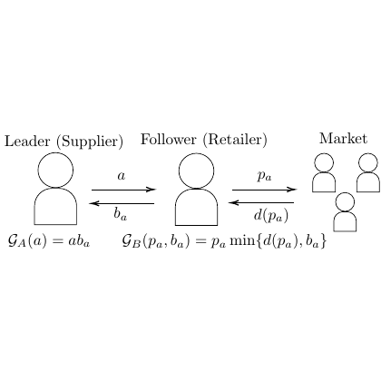

# test_103.png



# 1. Overview
The image depicts a Stackelberg game model showing a leader-follower relationship between a supplier and retailer, with market interaction. It includes two human figure icons with arrows showing their interactions, mathematical notation for decision variables (a, pa, ba), and game payoff functions.

# 2. Document Skeleton & Dependencies
```latex
\documentclass{article}
\usepackage{tikz}
\usepackage{amsmath}
\usepackage{amssymb}
\usetikzlibrary{positioning, arrows.meta, shapes.geometric}
```

# 3. Layout & Canvas Settings
```latex
\begin{tikzpicture}[
  scale=0.8,
  node distance=3cm,
  >={Stealth},
  thick
]
```

# 4. Fonts & Colors
The image uses standard black text with no special colors. Font appears to be a standard serif font (Computer Modern) with mathematical expressions in math mode.

# 5. Structure & Component Styles
- Human figure icons: Combination of circles (head) and trapezoids (body)
- Arrows: Straight lines with arrow tips
- Text labels: Positioned above/below figures and arrows
- Mathematical expressions: Positioned below the figures

# 6. Math/Table/Graphic Details
- Game payoff functions: $\mathcal{G}_A(a) = ab_a$ and $\mathcal{G}_B(p_a, b_a) = p_a \min\{d(p_a), b_a\}$
- Decision variables: $a$, $p_a$, $b_a$, $d(p_a)$
- Script G notation for game payoffs

# 7. Custom Macros & Commands
```latex
\tikzset{
  person/.style={
    append after command={
      \pgfextra{
        \draw (\tikzlastnode.north) circle (0.4cm);
        \draw (\tikzlastnode.north) +(-0.4,-0.4) -- +(-0.5,-1.2) -- +(0.5,-1.2) -- +(0.4,-0.4);
      }
    }
  },
  small person/.style={
    append after command={
      \pgfextra{
        \draw (\tikzlastnode.north) circle (0.25cm);
        \draw (\tikzlastnode.north) +(-0.25,-0.25) -- +(-0.3,-0.8) -- +(0.3,-0.8) -- +(0.25,-0.25);
      }
    }
  }
}
```

# 8. MWE (Minimum Working Example)
```latex
\documentclass{article}
\usepackage{tikz}
\usepackage{amsmath}
\usepackage{amssymb}
\usetikzlibrary{positioning, arrows.meta}

\begin{document}

\begin{tikzpicture}[
  scale=0.8,
  >={Stealth},
  thick,
  node distance=4cm
]
  % Define person style
  \tikzset{
    person/.style={
      minimum width=1cm,
      minimum height=0.1cm
    }
  }
  
  % Leader (Supplier)
  \node[person] (supplier) at (0,0) {};
  \draw (supplier.north) circle (0.5cm);
  \draw (supplier.north) +(-0.5,-0.5) -- +(-0.6,-1.5) -- +(0.6,-1.5) -- +(0.5,-0.5);
  \node at (0,1.5) {Leader (Supplier)};
  
  % Follower (Retailer)
  \node[person, right=of supplier] (retailer) {};
  \draw (retailer.north) circle (0.5cm);
  \draw (retailer.north) +(-0.5,-0.5) -- +(-0.6,-1.5) -- +(0.6,-1.5) -- +(0.5,-0.5);
  \node at (4,1.5) {Follower (Retailer)};
  
  % Market
  \node at (7.5,1.5) {Market};
  \node (market) at (7.5,0) {};
  
  % Market people
  \draw (market) +(0,0) circle (0.3cm);
  \draw (market) +(0,0) +(-0.3,-0.3) -- +(-0.35,-0.9) -- +(0.35,-0.9) -- +(0.3,-0.3);
  
  \draw (market) +(1,0) circle (0.3cm);
  \draw (market) +(1,0) +(-0.3,-0.3) -- +(-0.35,-0.9) -- +(0.35,-0.9) -- +(0.3,-0.3);
  
  \draw (market) +(0.5,-1) circle (0.3cm);
  \draw (market) +(0.5,-1) +(-0.3,-0.3) -- +(-0.35,-0.9) -- +(0.35,-0.9) -- +(0.3,-0.3);
  
  % Arrows and labels
  \draw[->] (supplier) -- node[above] {$a$} (retailer);
  \draw[<-] (supplier) -- node[below] {$b_a$} (retailer);
  
  \draw[->] (retailer) -- node[above] {$p_a$} (market);
  \draw[<-] (retailer) -- node[below] {$d(p_a)$} (market);
  
  % Game payoff functions
  \node at (0,-2.2) {$\mathcal{G}_A(a) = ab_a$};
  \node at (4,-2.2) {$\mathcal{G}_B(p_a, b_a) = p_a \min\{d(p_a), b_a\}$};
  
\end{tikzpicture}

\end{document}
```

# 9. Replication Checklist
- [ ] Two human figures labeled "Leader (Supplier)" and "Follower (Retailer)"
- [ ] Three smaller human figures representing the market
- [ ] Bidirectional arrows between supplier and retailer with labels $a$ and $b_a$
- [ ] Bidirectional arrows between retailer and market with labels $p_a$ and $d(p_a)$
- [ ] Game payoff functions $\mathcal{G}_A(a) = ab_a$ and $\mathcal{G}_B(p_a, b_a) = p_a \min\{d(p_a), b_a\}$
- [ ] Proper spacing and alignment of all elements

# 10. Risks & Alternatives
- Exact proportions of the human figures may differ slightly from the original
- Alternative approach: Use predefined icons from packages like `fontawesome` for human figures
- The spacing between elements might need adjustment based on document settings
- Consider using the `tikzpeople` package for more sophisticated human figures if available
