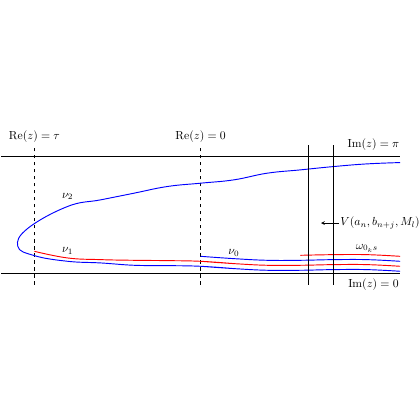

# test_104.png



# 1. Overview
The image shows a complex plane diagram with horizontal lines at Im(z) = 0 and Im(z) = π, and vertical lines at Re(z) = τ, Re(z) = 0, and another vertical position. Several curved paths (labeled ν₁, ν₂, ν₃) are drawn in blue and red, with some annotations including V(aₙ, bₙ₊₁, Mₙ) and ωₙ,s.

# 2. Document Skeleton & Dependencies
```latex
\documentclass{article}
\usepackage{tikz}
\usepackage{amsmath,amssymb}
\usepackage{xcolor}
\usetikzlibrary{decorations.markings,arrows.meta}
```

# 3. Layout & Canvas Settings
```latex
\begin{tikzpicture}[scale=1.2]
  % Canvas settings will be defined in the MWE
\end{tikzpicture}
```

# 4. Fonts & Colors
- Colors: Black for axes and labels, blue for primary curves, red for secondary curves
- Font styles: Standard math font for labels and annotations

# 5. Structure & Component Styles
- Dashed vertical and solid horizontal lines for the coordinate axes
- Blue curved paths for the main contours (ν₁, ν₂)
- Red curved paths for additional contours (ν₃)
- Text labels at specific positions

# 6. Math/Table/Graphic Details
- Mathematical notation: Re(z), Im(z), τ, ν₁, ν₂, ν₃
- Subscripts in labels: V(aₙ, bₙ₊₁, Mₙ), ωₙ,s

# 7. Custom Macros & Commands
```latex
\tikzset{
  axis/.style={thick},
  dashed axis/.style={dashed, thick},
  contour/.style={thick, blue},
  secondary/.style={thick, red}
}
```

# 8. MWE (Minimum Working Example)
```latex
\documentclass{article}
\usepackage{tikz}
\usepackage{amsmath,amssymb}

\begin{document}

\begin{tikzpicture}[scale=1.2]
  % Define coordinates
  \def\xmin{-2}
  \def\xmax{4}
  \def\ymin{-0.5}
  \def\ymax{3.5}
  
  % Draw axes
  \draw[dashed] (-1.5,\ymin) -- (-1.5,\ymax) node[above] {$\text{Re}(z) = \tau$};
  \draw[dashed] (0,\ymin) -- (0,\ymax) node[above] {$\text{Re}(z) = 0$};
  \draw[thick] (3,\ymin) -- (3,\ymax);
  \draw[thick] (3.3,\ymin) -- (3.3,\ymax);
  
  % Horizontal lines
  \draw[thick] (\xmin,0) -- (\xmax,0) node[right] {$\text{Im}(z) = 0$};
  \draw[thick] (\xmin,3.14) -- (\xmax,3.14) node[right] {$\text{Im}(z) = \pi$};
  
  % Draw curves
  % ν₁ curve
  \draw[thick, blue] (-1.5,1.5) to[out=0, in=180] (0,2) to[out=0, in=180] (3,2.5);
  
  % ν₂ curve
  \draw[thick, blue] (-1.5,0.7) to[out=0, in=180] (-0.8,0.5) to[out=0, in=180] (-0.3,0.7) 
                     to[out=0, in=180] (0,0.8) to[out=0, in=180] (3,1);
  
  % ν₃ curves (red)
  \draw[thick, red] (-1.5,0.4) to[out=0, in=180] (3,0.6);
  \draw[thick, red] (-1.5,0.3) to[out=0, in=180] (3,0.5);
  \draw[thick, red] (-1.5,0.2) to[out=0, in=180] (3,0.4);
  
  % Additional blue curves
  \draw[thick, blue] (-1.5,0.5) to[out=0, in=180] (3,0.7);
  \draw[thick, blue] (-1.5,0.6) to[out=0, in=180] (3,0.8);
  
  % Labels
  \node at (-0.8,0.9) {$\nu_2$};
  \node at (-0.8,0.3) {$\nu_3$};
  \node at (0.5,1.7) {$\nu_1$};
  \node[right] at (3.3,1.5) {$V(a_n, b_{n+1}, M_n)$};
  \node[right] at (3.3,0.5) {$\omega_{n,s}$};
\end{tikzpicture}

\end{document}
```

# 9. Replication Checklist
- Vertical dashed lines at Re(z) = τ and Re(z) = 0
- Vertical solid lines at two positions on the right
- Horizontal lines at Im(z) = 0 and Im(z) = π
- Blue curves labeled ν₁ and ν₂
- Red curves labeled ν₃
- Additional blue curves near the bottom
- Labels for V(aₙ, bₙ₊₁, Mₙ) and ωₙ,s

# 10. Risks & Alternatives
- Exact curve shapes may differ from original; adjust control points as needed
- Label positioning might need fine-tuning based on your specific document settings
- Consider using the `pgfplots` package as an alternative for more precise mathematical plotting
- For better curve control, consider using Bézier curves with explicit control points
