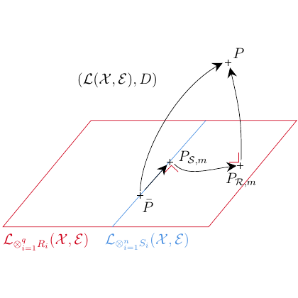

# test_105.png



# 1. Overview
The image shows a mathematical diagram illustrating a mapping between spaces. It depicts a parallelogram representing a plane with labeled points P, PS,m, PR,m and mathematical notation (L(X,E),D). The diagram uses arrows to show transformations or relationships between these points, with color-coded labels at the bottom edges of the parallelogram.

# 2. Document Skeleton & Dependencies
```latex
\documentclass{article}
\usepackage{tikz}
\usepackage{amsmath,amssymb}
\usepackage{xcolor}
\usetikzlibrary{arrows.meta,bending,positioning,calc}
```

# 3. Layout & Canvas Settings
```latex
\begin{tikzpicture}[
  scale=1.5,
  > = Stealth,
  thick
]
```

# 4. Fonts & Colors
```latex
\colorlet{redcolor}{red!70!black}
\colorlet{bluecolor}{blue!70!black}
\colorlet{arrowcolor}{black!80}
```

The text uses standard math mode italic font for variables and subscripts.

# 5. Structure & Component Styles
- Parallelogram: Red border, no fill
- Points: Small dots with labels
- Arrows: Curved black arrows connecting points
- Labels: Mathematical expressions in standard LaTeX math mode

# 6. Math/Table/Graphic Details
- Mathematical notation includes:
  - L(X,E) with script L
  - Subscripts S,m and R,m
  - Point P appears twice in the diagram
  - Special notation (L(X,E),D)

# 7. Custom Macros & Commands
```latex
\tikzset{
  point/.style={circle, fill, inner sep=1.5pt},
  curved arrow/.style={->, thick, bend left=15}
}
```

# 8. MWE (Minimum Working Example)
```latex
\documentclass{article}
\usepackage{tikz}
\usepackage{amsmath,amssymb}
\usepackage{xcolor}
\usetikzlibrary{arrows.meta,bending,positioning,calc}

\begin{document}

\begin{tikzpicture}[scale=1.5, > = Stealth, thick]
  % Define colors
  \colorlet{redcolor}{red!70!black}
  \colorlet{bluecolor}{blue!70!black}
  
  % Draw the parallelogram
  \draw[redcolor] (-2,-1) -- (2,-1) -- (3,0) -- (-1,0) -- cycle;
  
  % Draw the blue line
  \draw[bluecolor] (-1,-1) -- (0,0);
  
  % Place points
  \node[circle, fill, inner sep=1.5pt] (p_bottom) at (0,-0.5) {};
  \node[circle, fill, inner sep=1.5pt] (p_top) at (2,1) {};
  \node[circle, fill, inner sep=1.5pt] (ps) at (1,-0.5) {};
  \node[circle, fill, inner sep=1.5pt] (pr) at (2,-0.5) {};
  
  % Add labels
  \node at (0,-0.65) {$P$};
  \node at (2.15,1.15) {$P$};
  \node at (1,-0.35) {$P_{S,m}$};
  \node at (2.15,-0.35) {$P_{R,m}$};
  \node at (0,0.5) {$(\mathcal{L}(X,\mathcal{E}),D)$};
  
  % Add bottom labels
  \node[redcolor] at (-1.5,-1.2) {$\mathcal{L}_{i=1}^{q_n,R}(X,\mathcal{E})$};
  \node[bluecolor] at (1.5,-1.2) {$\mathcal{L}_{i=1}^{q_n,S}(X,\mathcal{E})$};
  
  % Add arrows
  \draw[->, bend left=15] (p_bottom) to (p_top);
  \draw[->, bend left=15] (p_bottom) to (ps);
  \draw[->, bend left=15] (ps) to (pr);
  \draw[->, bend left=15] (pr) to (p_top);
\end{tikzpicture}

\end{document}
```

# 9. Replication Checklist
- [ ] Parallelogram has correct red border
- [ ] Blue line appears on left side
- [ ] Four points are correctly positioned
- [ ] All mathematical labels use correct notation
- [ ] Arrows connect points in the right sequence
- [ ] Bottom labels use correct colors and script font

# 10. Risks & Alternatives
- Exact positioning of elements might require fine-tuning
- Mathematical notation might need adjustments based on specific requirements
- Alternative implementation could use TikZ matrix for more precise positioning
- Consider using `tikz-cd` package if this represents a commutative diagram
