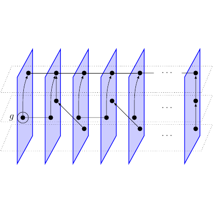

# test_106.png



# Recreating the TikZ Diagram

## 1. Overview
The image shows a series of parallel vertical planes (blue parallelograms) with interconnected black dots representing a graph structure. The planes are arranged in sequence with connecting lines between nodes across adjacent planes. A specific node is highlighted with a circle on the left side, labeled with "g".

## 2. Document Skeleton & Dependencies
```latex
\documentclass{article}
\usepackage{tikz}
\usepackage{amsmath,amssymb}
\usetikzlibrary{backgrounds,fit,positioning,calc}
```

## 3. Layout & Canvas Settings
```latex
\begin{tikzpicture}[
  scale=1.2,
  every node/.style={transform shape},
  dot/.style={circle, fill, inner sep=2pt},
  highlighted dot/.style={circle, draw, fill, inner sep=2pt, double, double distance=1pt}
]
```

## 4. Fonts & Colors
```latex
\definecolor{planeblue}{RGB}{200,210,255}
\definecolor{planeborder}{RGB}{0,0,255}
```

## 5. Structure & Component Styles
- Vertical planes: Blue parallelograms with opacity 0.5
- Nodes: Black filled circles
- Highlighted node: Black filled circle with additional outline
- Connections: Black straight lines between nodes
- Dotted grid lines: Light gray dotted horizontal and vertical lines

## 6. Math/Graphic Details
- The label "g" is in italic math mode
- Ellipsis notation "..." is used to indicate continuation of the pattern

## 7. Custom Macros & Commands
```latex
\tikzset{
  plane/.style={draw=planeborder, fill=planeblue, fill opacity=0.5},
  dots/.style={dotted, gray!50, thin}
}
```

## 8. MWE (Minimum Working Example)
```latex
\documentclass{article}
\usepackage{tikz}
\usepackage{amsmath}
\usetikzlibrary{backgrounds,fit,positioning}

\begin{document}

\begin{tikzpicture}[scale=1.2]
  % Define colors
  \definecolor{planeblue}{RGB}{200,210,255}
  \definecolor{planeborder}{RGB}{0,0,255}
  
  % Define styles
  \tikzset{
    plane/.style={draw=planeborder, fill=planeblue, fill opacity=0.5},
    dots/.style={dotted, gray!50, thin},
    dot/.style={circle, fill, inner sep=2pt},
    highlighted dot/.style={circle, draw, fill, inner sep=2pt, double, double distance=1pt}
  }
  
  % Draw background dotted grid
  \foreach \y in {0,1,2,3}{
    \draw[dots] (-1.5,-0.5) -- (10.5,-0.5+\y);
  }
  
  % Draw planes
  \foreach \x in {0,1,2,3,4,8}{
    % Draw dotted vertical lines
    \draw[dots] (\x*1.8-0.5,-0.5) -- (\x*1.8-0.5,2.5);
    
    % Draw planes
    \draw[plane] (\x*1.8-0.5,-0.5) -- (\x*1.8+0.5,-0.5) -- (\x*1.8+0.5,2.5) -- (\x*1.8-0.5,2.5) -- cycle;
  }
  
  % Draw ellipsis for skipped planes
  \node at (6.5,1) {$\ldots$};
  
  % Draw nodes on planes
  \foreach \x in {0,1,2,3,4,8}{
    \ifnum\x=0
      \node[highlighted dot] (n\x1) at (\x*1.8,1) {};
      \node at (\x*1.8-0.3,1) {$g$};
    \else
      \node[dot] (n\x1) at (\x*1.8,1) {};
    \fi
    \node[dot] (n\x2) at (\x*1.8,0) {};
    \node[dot] (n\x3) at (\x*1.8,2) {};
  }
  
  % Draw connections between nodes
  \foreach \x [evaluate=\x as \nextx using int(\x+1)] in {0,1,2,3}{
    \draw (n\x1) -- (n\nextx1);
    \draw (n\x2) -- (n\nextx3);
    \draw (n\x3) -- (n\nextx2);
  }
  
  % Draw connections to last plane
  \draw (n41) -- (n81);
  \draw (n42) -- (n83);
  \draw (n43) -- (n82);
  
  % Draw ellipsis for connections
  \draw[dots] (n41) -- (n81);
  \draw[dots] (n42) -- (n83);
  \draw[dots] (n43) -- (n82);
\end{tikzpicture}

\end{document}
```

## 9. Replication Checklist
- [ ] Blue transparent vertical planes with correct spacing
- [ ] Black dots positioned correctly on each plane
- [ ] Highlighted node with circle and "g" label
- [ ] Connections between nodes across adjacent planes
- [ ] Dotted grid lines in background
- [ ] Ellipsis notation showing continuation

## 10. Risks & Alternatives
- Exact color matching might vary between PDF viewers
- The perspective effect of the planes might need adjustment
- Alternative implementation could use 3D libraries like `tikz-3dplot` for more accurate perspective
- The dotted lines might need opacity adjustment depending on the output format
