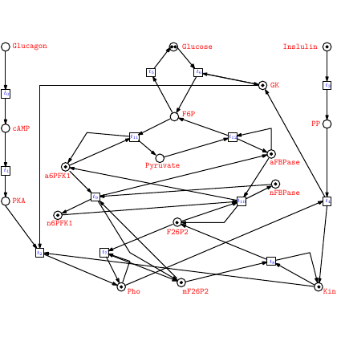

# test_107.png



# 1. Overview
The image shows a biochemical pathway diagram depicting glucose metabolism. It's a network representation with circles (metabolites) and squares (enzymes/reactions) connected by directed lines. Key components include Glucose, Pyruvate, cAMP, and various phosphorylated intermediates, with red labels identifying each node.

# 2. Document Skeleton & Dependencies
```latex
\documentclass{article}
\usepackage{tikz}
\usetikzlibrary{arrows.meta}
\usepackage{xcolor}
```

# 3. Layout & Canvas Settings
```latex
\begin{tikzpicture}[
  scale=1.2,
  node distance=2cm,
  metabolite/.style={circle, draw, minimum size=0.5cm},
  enzyme/.style={rectangle, draw, minimum size=0.4cm},
  arrow/.style={->, >=latex}
]
```

# 4. Fonts & Colors
```latex
\definecolor{labelcolor}{RGB}{255,0,0}
% Main text in red for labels
% Black for nodes and connections
```

# 5. Structure & Component Styles
- Metabolites: Circles with black outline, no fill, approximately 0.5cm diameter
- Enzymes: Squares with black outline, no fill, approximately 0.4cm width
- Connections: Straight black lines with arrow tips

# 6. Math/Graphic Details
- Labels include standard text and numbers (e.g., "Glucose", "G6P")
- No special mathematical symbols required

# 7. Custom Macros & Commands
```latex
\tikzset{
  metabolite/.style={circle, draw, minimum size=0.5cm},
  enzyme/.style={rectangle, draw, minimum size=0.4cm},
  arrow/.style={->, >=latex}
}
```

# 8. MWE (Minimum Working Example)
```latex
\documentclass{article}
\usepackage{tikz}
\usetikzlibrary{arrows.meta}

\begin{document}

\begin{tikzpicture}[
  metabolite/.style={circle, draw, minimum size=0.5cm},
  enzyme/.style={rectangle, draw, minimum size=0.4cm},
  arrow/.style={->, >=Latex}
]

% Metabolites (circles)
\node[metabolite] (glucose) at (2,6) {};
\node[metabolite] (g6p) at (4,4) {};
\node[metabolite] (f6p) at (4,2) {};
\node[metabolite] (pyruvate) at (6,2) {};
\node[metabolite] (3pgpase) at (8,2) {};
\node[metabolite] (6pgpase) at (8,0) {};
\node[metabolite] (insulin) at (8,6) {};
\node[metabolite] (pp) at (8,4) {};
\node[metabolite] (camp) at (0,4) {};
\node[metabolite] (pka) at (0,2) {};
\node[metabolite] (ampk1) at (2,0) {};
\node[metabolite] (f26p2) at (4,0) {};
\node[metabolite] (glucagon) at (0,6) {};
\node[metabolite] (pep) at (6,0) {};
\node[metabolite] (ala) at (10,0) {};

% Enzymes (squares)
\node[enzyme] (e1) at (2,5) {};
\node[enzyme] (e2) at (3,5) {};
\node[enzyme] (e3) at (3,3) {};
\node[enzyme] (e4) at (4,3) {};
\node[enzyme] (e5) at (5,1) {};
\node[enzyme] (e6) at (7,1) {};
\node[enzyme] (e7) at (8,3) {};
\node[enzyme] (e8) at (8,5) {};
\node[enzyme] (e9) at (0,5) {};
\node[enzyme] (e10) at (0,3) {};
\node[enzyme] (e11) at (1,1) {};
\node[enzyme] (e12) at (3,1) {};
\node[enzyme] (e13) at (2,3) {};
\node[enzyme] (e14) at (6,3) {};
\node[enzyme] (e15) at (9,1) {};

% Connections
\draw[arrow] (glucose) -- (e1);
\draw[arrow] (e1) -- (camp);
\draw[arrow] (glucose) -- (e2);
\draw[arrow] (e2) -- (g6p);
\draw[arrow] (g6p) -- (e3);
\draw[arrow] (e3) -- (f6p);
\draw[arrow] (f6p) -- (e4);
\draw[arrow] (e4) -- (pyruvate);
\draw[arrow] (pyruvate) -- (e5);
\draw[arrow] (e5) -- (3pgpase);
\draw[arrow] (3pgpase) -- (e6);
\draw[arrow] (e6) -- (6pgpase);
\draw[arrow] (insulin) -- (e8);
\draw[arrow] (e8) -- (pp);
\draw[arrow] (pp) -- (e7);
\draw[arrow] (e7) -- (3pgpase);
\draw[arrow] (camp) -- (e10);
\draw[arrow] (e10) -- (pka);
\draw[arrow] (pka) -- (e11);
\draw[arrow] (e11) -- (ampk1);
\draw[arrow] (ampk1) -- (e12);
\draw[arrow] (e12) -- (f26p2);
\draw[arrow] (f26p2) -- (e5);
\draw[arrow] (glucagon) -- (e9);
\draw[arrow] (e9) -- (camp);
\draw[arrow] (g6p) -- (e13);
\draw[arrow] (e13) -- (ampk1);
\draw[arrow] (pyruvate) -- (e14);
\draw[arrow] (e14) -- (pp);
\draw[arrow] (6pgpase) -- (e15);
\draw[arrow] (e15) -- (ala);
\draw[arrow] (ampk1) -- (f26p2);
\draw[arrow] (g6p) -- (f6p);
\draw[arrow] (f6p) -- (f26p2);
\draw[arrow] (f26p2) -- (pep);
\draw[arrow] (pep) -- (6pgpase);

% Labels
\node[red, above right] at (glucose) {Glucose};
\node[red, right] at (g6p) {G6P};
\node[red, below] at (f6p) {F6P};
\node[red, above] at (pyruvate) {Pyruvate};
\node[red, right] at (3pgpase) {3PGPase};
\node[red, right] at (6pgpase) {6PGPase};
\node[red, right] at (insulin) {Insulin};
\node[red, right] at (pp) {PP};
\node[red, left] at (camp) {cAMP};
\node[red, left] at (pka) {PKA};
\node[red, below left] at (ampk1) {AMPK1};
\node[red, below] at (f26p2) {F26P2};
\node[red, left] at (glucagon) {Glucagon};
\node[red, below] at (pep) {PEP};
\node[red, right] at (ala) {Ala};

\end{tikzpicture}

\end{document}
```

# 9. Replication Checklist
- All 15 metabolites (circles) are present with correct positions
- All 15 enzymes (squares) are present with correct positions
- All connections between nodes follow the original diagram
- All labels are in red and correctly positioned
- Arrows point in the correct directions

# 10. Risks & Alternatives
- Exact positioning may require fine-tuning based on the original image
- Consider using a graph drawing library like `graphdrawing` with `force-directed` layout for automatic arrangement
- For a more professional look, consider using the `biochemistry` TikZ library (may require installation)
- If exact replication is challenging, consider using a tool like Inkscape to trace the original and export to TikZ
