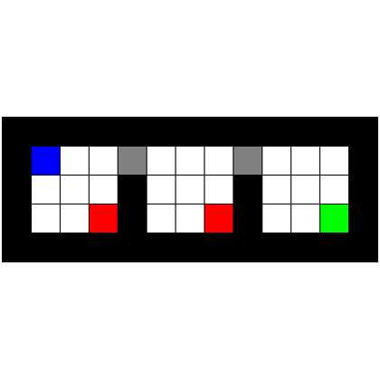

# test_108.png



# 1. Overview
The image shows three 4x3 grids arranged horizontally on a black background. Each grid has colored cells: the first grid has a blue cell in the top-left and a red cell in the bottom-right, the second grid has two gray cells in the top row and a red cell in the bottom-right, and the third grid has two gray cells in the top row and a green cell in the bottom-right.

# 2. Document Skeleton & Dependencies
```latex
\documentclass{article}
\usepackage{tikz}
\usepackage{xcolor}
```

# 3. Layout & Canvas Settings
```latex
\begin{tikzpicture}[scale=0.5]
  % Canvas is approximately 22x6 units
  % Each cell is 1x1 unit
```

# 4. Fonts & Colors
```latex
\definecolor{gridgray}{RGB}{128,128,128}
\definecolor{gridblue}{RGB}{0,0,255}
\definecolor{gridred}{RGB}{255,0,0}
\definecolor{gridgreen}{RGB}{0,255,0}
```

# 5. Structure & Component Styles
- Black background rectangle: covers the entire image
- Three 4x3 grids with white cells and thin black borders
- Colored cells: blue, red, green, and gray
- Each cell is a 1x1 square

# 6. Math/Table/Graphic Details
No mathematical symbols or special graphics are present in the image.

# 7. Custom Macros & Commands
```latex
\tikzset{
  grid cell/.style={rectangle, draw=black, minimum size=1cm, inner sep=0pt},
  filled cell/.style={grid cell, fill=#1}
}
```

# 8. MWE (Minimum Working Example)
```latex
\documentclass{article}
\usepackage{tikz}
\usepackage[margin=1cm]{geometry}

\begin{document}

\begin{tikzpicture}[scale=0.5]
  % Background
  \fill[black] (-1,-1) rectangle (22,7);
  
  % Grid styles
  \tikzset{
    grid cell/.style={rectangle, draw=black, minimum size=1cm, inner sep=0pt, fill=white},
    filled cell/.style={grid cell, fill=#1}
  }
  
  % First grid
  \foreach \x in {0,...,3} {
    \foreach \y in {0,...,3} {
      \ifnum\x=0
        \ifnum\y=0
          \node[filled cell=blue] at (\x,\y) {};
        \else
          \node[grid cell] at (\x,\y) {};
        \fi
      \else
        \ifnum\x=2
          \ifnum\y=0
            \node[filled cell=red] at (\x,\y) {};
          \else
            \node[grid cell] at (\x,\y) {};
          \fi
        \else
          \node[grid cell] at (\x,\y) {};
        \fi
      \fi
    }
  }
  
  % Second grid
  \foreach \x in {7,...,10} {
    \foreach \y in {0,...,3} {
      \ifnum\y=3
        \ifnum\x=7
          \node[filled cell=gray] at (\x,\y) {};
        \else
          \ifnum\x=9
            \node[filled cell=gray] at (\x,\y) {};
          \else
            \node[grid cell] at (\x,\y) {};
          \fi
        \fi
      \else
        \ifnum\x=9
          \ifnum\y=0
            \node[filled cell=red] at (\x,\y) {};
          \else
            \node[grid cell] at (\x,\y) {};
          \fi
        \else
          \node[grid cell] at (\x,\y) {};
        \fi
      \fi
    }
  }
  
  % Third grid
  \foreach \x in {14,...,17} {
    \foreach \y in {0,...,3} {
      \ifnum\y=3
        \ifnum\x=14
          \node[filled cell=gray] at (\x,\y) {};
        \else
          \ifnum\x=16
            \node[filled cell=gray] at (\x,\y) {};
          \else
            \node[grid cell] at (\x,\y) {};
          \fi
        \fi
      \else
        \ifnum\x=17
          \ifnum\y=0
            \node[filled cell=green] at (\x,\y) {};
          \else
            \node[grid cell] at (\x,\y) {};
          \fi
        \else
          \node[grid cell] at (\x,\y) {};
        \fi
      \fi
    }
  }
\end{tikzpicture}

\end{document}
```

# 9. Replication Checklist
- Black background covers the entire image
- Three 4x3 grids are evenly spaced horizontally
- Grid 1: Blue cell at top-left, red cell at bottom-right
- Grid 2: Two gray cells in top row, red cell at bottom-right
- Grid 3: Two gray cells in top row, green cell at bottom-right
- All other cells are white with black borders

# 10. Risks & Alternatives
- Color matching might not be exact; adjust RGB values as needed
- Grid spacing might need adjustment based on desired output size
- Alternative implementation could use a matrix-based approach with `\matrix` in TikZ
- For better control over cell positions, you could use explicit coordinates instead of the foreach loops
