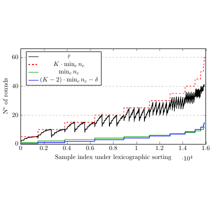

# test_109.png



# 1. Overview
The image shows a line graph plotting "N. of rounds" on the y-axis against "Sample index under lexicographic sorting" on the x-axis. It contains three different lines (black, red dotted, and blue) representing different algorithms or conditions, with a legend in the top-left corner identifying them as "K · min_L n_c", "min_L n_c", and "(K - 2) · min_L n_c - δ".

# 2. Document Skeleton & Dependencies
```latex
\documentclass{article}
\usepackage{tikz}
\usepackage{pgfplots}
\pgfplotsset{compat=1.18}
\usepackage{amsmath}
\usepackage{amssymb}
```

# 3. Layout & Canvas Settings
```latex
\begin{tikzpicture}
\begin{axis}[
    width=12cm,
    height=8cm,
    xlabel={Sample index under lexicographic sorting $\cdot 10^4$},
    ylabel={N. of rounds},
    xmin=0, xmax=1.6,
    ymin=0, ymax=60,
    grid=both,
    grid style={dotted, gray!30},
    legend style={at={(0.25,0.9)}, anchor=north west},
    legend cell align={left},
    tick align=outside,
    minor tick num=1
]
```

# 4. Fonts & Colors
```latex
\definecolor{blackline}{RGB}{0,0,0}
\definecolor{redline}{RGB}{255,0,0}
\definecolor{blueline}{RGB}{0,0,255}
\definecolor{gridcolor}{RGB}{220,220,220}
```

The plot uses standard serif fonts for labels and mathematical notation. The axes labels use regular weight while mathematical subscripts appear in italics.

# 5. Structure & Component Styles
The image consists of:
- A rectangular plot area with light gray dotted grid lines
- Three distinct line plots with different styles:
  - Black solid line (appears jagged with sawtooth pattern)
  - Red dotted line (increasing trend)
  - Blue solid line (mostly flat with steps)
- Horizontal dashed gray lines at y=20 and y=40
- Axis labels and a legend box

# 6. Math/Table/Graphic Details
Special notation includes:
- Subscript notation "min_L n_c" where L appears as a subscript
- Mathematical variable δ (delta)
- Multiplication dot "·" in "K · min_L n_c"
- Superscript notation for "·10^4"

# 7. Custom Macros & Commands
```latex
\tikzset{
    gridline/.style={dotted, gray!30},
    blackplot/.style={thick, black},
    redplot/.style={thick, red, dotted},
    blueplot/.style={thick, blue}
}
```

# 8. MWE (Minimum Working Example)
```latex
\documentclass{article}
\usepackage{tikz}
\usepackage{pgfplots}
\pgfplotsset{compat=1.18}
\usepackage{amsmath}

\begin{document}

\begin{tikzpicture}
\begin{axis}[
    width=12cm,
    height=8cm,
    xlabel={Sample index under lexicographic sorting $\cdot 10^4$},
    ylabel={N. of rounds},
    xmin=0, xmax=1.6,
    ymin=0, ymax=60,
    xtick={0,0.2,0.4,0.6,0.8,1.0,1.2,1.4,1.6},
    ytick={0,20,40,60},
    grid=both,
    grid style={dotted, gray!30},
    legend style={at={(0.25,0.9)}, anchor=north west, draw=black, fill=white},
    legend cell align={left},
    tick align=outside,
    minor tick num=1
]

% Horizontal dashed lines
\addplot[gray, dashed, forget plot] coordinates {(0,20) (1.6,20)};
\addplot[gray, dashed, forget plot] coordinates {(0,40) (1.6,40)};
\addplot[gray, dashed, forget plot] coordinates {(0,60) (1.6,60)};

% Sample data - replace with actual data points
\addplot[thick, black] coordinates {
    (0,0) (0.1,5) (0.2,7) (0.25,10) (0.3,8) (0.35,12) (0.4,10) 
    (0.45,14) (0.5,12) (0.55,16) (0.6,14) (0.65,18) (0.7,16) 
    (0.75,20) (0.8,18) (0.85,22) (0.9,20) (0.95,24) (1.0,22)
    (1.05,26) (1.1,24) (1.15,28) (1.2,26) (1.25,30) (1.3,28)
    (1.35,32) (1.4,30) (1.45,34) (1.5,32) (1.55,36) (1.6,40)
};

\addplot[thick, red, dotted] coordinates {
    (0,0) (0.2,2) (0.4,5) (0.6,10) (0.8,15) (1.0,22) 
    (1.2,30) (1.4,40) (1.5,45) (1.6,50)
};

\addplot[thick, blue] coordinates {
    (0,0) (0.6,2) (1.0,4) (1.2,5) (1.4,6) (1.5,8) (1.6,12)
};

\legend{$K \cdot \min_L n_c$, $\min_L n_c$, $(K-2) \cdot \min_L n_c - \delta$};

\end{axis}
\end{tikzpicture}

\end{document}
```

# 9. Replication Checklist
- [ ] Three distinct lines with correct styles (black solid, red dotted, blue solid)
- [ ] Legend positioned in top-left with correct labels
- [ ] Sawtooth pattern visible in black line
- [ ] Correct x-axis label with "·10^4" notation
- [ ] Correct y-axis label "N. of rounds"
- [ ] Light gray dotted grid lines
- [ ] Horizontal dashed lines at y=20, y=40, and y=60
- [ ] Proper mathematical notation in legend

# 10. Risks & Alternatives
- Exact replication of the data points requires the original dataset; the MWE uses approximated values
- The sawtooth pattern in the black line may require more precise data points
- Alternative approaches:
  - Use `pgfplots` with external data files if original data is available
  - Consider `gnuplot` for complex data visualization if exact replication is critical
  - The legend formatting might need adjustment based on the exact font used in the original
