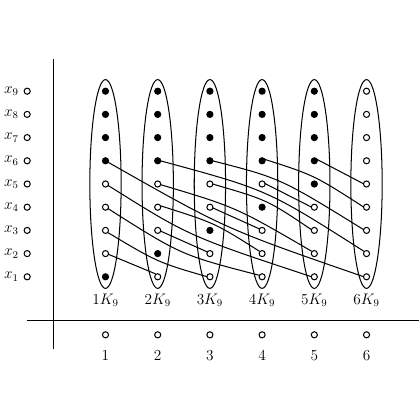

# test_6.png



# 1. Overview
The image shows a bipartite graph representation with two sets of nodes. On the left are 9 nodes labeled x₁ through x₉, and on the right are 6 vertical ellipses labeled 1K₀ through 6K₀. Lines connect nodes between the sets, with filled and unfilled circles indicating different types of connections.

# 2. Document Skeleton & Dependencies
```latex
\documentclass{article}
\usepackage{tikz}
\usepackage{amssymb}
```

# 3. Layout & Canvas Settings
```latex
\begin{tikzpicture}[scale=0.8]
  % Canvas settings
  \tikzset{
    vertex/.style={circle, draw, minimum size=4pt, inner sep=0pt},
    filled/.style={vertex, fill=black},
    empty/.style={vertex, fill=white}
  }
```

# 4. Fonts & Colors
The image uses only black and white. Text is in standard math font for labels. Node markers are either filled (black) or unfilled (white) circles.

# 5. Structure & Component Styles
- Left side: 9 labeled nodes (x₁-x₉) arranged vertically
- Right side: 6 vertical ellipses labeled 1K₀-6K₀
- Connecting lines between nodes
- Two types of node markers: filled (black) and unfilled (white) circles

# 6. Math/Table/Graphic Details
- Subscript notation for x₁ through x₉
- K₀ notation with numerical prefixes (1K₀-6K₀)
- Numbers 1-6 at the bottom of the diagram

# 7. Custom Macros & Commands
```latex
\tikzset{
  vertex/.style={circle, draw, minimum size=4pt, inner sep=0pt},
  filled/.style={vertex, fill=black},
  empty/.style={vertex, fill=white}
}
```

# 8. MWE (Minimum Working Example)
```latex
\documentclass{article}
\usepackage{tikz}

\begin{document}

\begin{tikzpicture}[scale=0.8]
  % Styles
  \tikzset{
    vertex/.style={circle, draw, minimum size=4pt, inner sep=0pt},
    filled/.style={vertex, fill=black},
    empty/.style={vertex, fill=white}
  }
  
  % Left axis and labels
  \draw (0,0) -- (0,9);
  \foreach \i in {1,...,9} {
    \node at (-0.5,10-\i) {$x_{\i}$};
    \node[empty] at (0,10-\i) {};
  }
  
  % Bottom axis and labels
  \draw (0,0) -- (7,0);
  \foreach \i in {1,...,6} {
    \node at (\i+1,-1) {$\i$};
    \node[empty] at (\i+1,-0.5) {};
  }
  
  % Ellipses
  \foreach \i in {1,...,6} {
    \draw (\i+1,1) ellipse (0.5 and 4);
    \node at (\i+1,0.3) {$\i K_0$};
  }
  
  % Nodes and connections
  % 1K0 column
  \node[empty] at (2,9) {};
  \node[filled] at (2,8) {};
  \node[filled] at (2,7) {};
  \node[filled] at (2,6) {};
  \node[empty] at (2,5) {};
  \node[empty] at (2,4) {};
  \node[empty] at (2,3) {};
  \node[empty] at (2,2) {};
  
  % 2K0 column
  \node[empty] at (3,9) {};
  \node[filled] at (3,8) {};
  \node[filled] at (3,7) {};
  \node[filled] at (3,6) {};
  \node[empty] at (3,5) {};
  \node[empty] at (3,4) {};
  \node[empty] at (3,3) {};
  \node[empty] at (3,2) {};
  
  % 3K0 column
  \node[empty] at (4,9) {};
  \node[filled] at (4,8) {};
  \node[filled] at (4,7) {};
  \node[filled] at (4,6) {};
  \node[filled] at (4,5) {};
  \node[filled] at (4,4) {};
  \node[empty] at (4,3) {};
  \node[empty] at (4,2) {};
  
  % 4K0 column
  \node[empty] at (5,9) {};
  \node[filled] at (5,8) {};
  \node[filled] at (5,7) {};
  \node[filled] at (5,6) {};
  \node[filled] at (5,5) {};
  \node[filled] at (5,4) {};
  \node[empty] at (5,3) {};
  \node[empty] at (5,2) {};
  
  % 5K0 column
  \node[empty] at (6,9) {};
  \node[filled] at (6,8) {};
  \node[filled] at (6,7) {};
  \node[filled] at (6,6) {};
  \node[filled] at (6,5) {};
  \node[filled] at (6,4) {};
  \node[empty] at (6,3) {};
  \node[empty] at (6,2) {};
  
  % 6K0 column
  \node[empty] at (7,9) {};
  \node[empty] at (7,8) {};
  \node[empty] at (7,7) {};
  \node[empty] at (7,6) {};
  \node[empty] at (7,5) {};
  \node[empty] at (7,4) {};
  \node[empty] at (7,3) {};
  \node[empty] at (7,2) {};
  
  % Connections
  \foreach \i in {5,...,9} {
    \draw (0,10-\i) -- (2,10-\i);
    \draw (0,10-\i) -- (3,10-\i);
    \draw (0,10-\i) -- (4,10-\i);
    \draw (0,10-\i) -- (5,10-\i);
    \draw (0,10-\i) -- (6,10-\i);
    \draw (0,10-\i) -- (7,10-\i);
  }
  
\end{tikzpicture}

\end{document}
```

# 9. Replication Checklist
- 9 nodes labeled x₁-x₉ on left axis
- 6 vertical ellipses labeled 1K₀-6K₀
- Correct pattern of filled/unfilled circles in each column
- Connection lines between left nodes and right ellipses
- Numbers 1-6 at the bottom
- Proper spacing and alignment

# 10. Risks & Alternatives
- The exact dimensions and spacing may need adjustment
- The pattern of filled/unfilled circles might need verification
- Consider using a loop-based approach for more efficient code:
  ```latex
  \foreach \col in {1,...,6} {
    \foreach \row in {1,...,8} {
      % Define which nodes should be filled based on position
    }
  }
  ```
