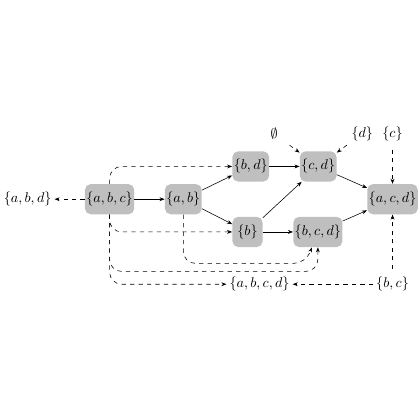

# test_7.png



# Recreating the TikZ Diagram of Set Relations

## 1. Overview
The image shows a directed graph representing set relations. It displays various sets (shown as rounded rectangles) with their elements in mathematical notation, connected by arrows indicating relationships between them. The sets contain combinations of elements {a, b, c, d} with directed edges showing transitions between sets.

## 2. Document Skeleton & Dependencies
```latex
\documentclass{article}
\usepackage{tikz}
\usetikzlibrary{shapes.misc, positioning, arrows.meta, calc}
\usepackage{amssymb}
\usepackage{amsmath}
```

## 3. Layout & Canvas Settings
```latex
\begin{tikzpicture}[
  scale=1.0,
  node distance=1.5cm,
  every node/.style={font=\small}
]
```

## 4. Fonts & Colors
```latex
\colorlet{nodecolor}{gray!30}
\colorlet{textcolor}{black}
\colorlet{arrowcolor}{black}
\colorlet{dashedcolor}{gray!70}
```

## 5. Structure & Component Styles
- Rounded rectangles for sets: gray fill with black text
- Solid arrows for primary transitions
- Dashed arrows for secondary relationships
- Node style with rounded corners and fixed padding

## 6. Math/Table/Graphic Details
- Set notation using curly braces: `$\{a,b,c\}$`
- Elements represented as lowercase letters
- Empty set represented as `$\emptyset$`

## 7. Custom Macros & Commands
```latex
\tikzset{
  set/.style={
    draw=black,
    fill=nodecolor,
    rounded corners=3pt,
    inner sep=4pt,
    text=textcolor
  },
  transition/.style={
    ->,
    >=Stealth,
    thick,
    arrowcolor
  },
  dashed transition/.style={
    transition,
    dashed,
    dashedcolor
  }
}
```

## 8. MWE (Minimum Working Example)
```latex
\documentclass{article}
\usepackage{tikz}
\usetikzlibrary{shapes.misc, positioning, arrows.meta, calc}

\begin{document}

\begin{tikzpicture}[
  node distance=1.5cm,
  set/.style={draw, fill=gray!30, rounded corners=3pt, inner sep=4pt},
  transition/.style={->, >=Stealth, thick},
  dashed transition/.style={transition, dashed, gray}
]

% Define nodes (sets)
\node[set] (ab) at (0,0) {$\{a,b\}$};
\node[set] (abc) at (-2,0) {$\{a,b,c\}$};
\node[set] (abd) at (0,1.5) {$\{b,d\}$};
\node[set] (b) at (0,-1.5) {$\{b\}$};
\node[set] (bcd) at (2,-1.5) {$\{b,c,d\}$};
\node[set] (cd) at (2,1.5) {$\{c,d\}$};
\node[set] (acd) at (2,0) {$\{a,c,d\}$};
\node[set] (abcd) at (0,-3) {$\{a,b,c,d\}$};
\node[set] (d) at (3.5,1.5) {$\{d\}$};
\node[set] (c) at (4.5,1.5) {$\{c\}$};
\node[set] (bc) at (4.5,-3) {$\{b,c\}$};

% Draw solid transitions
\draw[transition] (abc) -- (ab);
\draw[transition] (ab) -- (abd);
\draw[transition] (ab) -- (b);
\draw[transition] (abd) -- (cd);
\draw[transition] (abd) -- (bcd);
\draw[transition] (b) -- (bcd);
\draw[transition] (cd) -- (d);
\draw[transition] (cd) -- (acd);
\draw[transition] (acd) -- (bcd);

% Draw dashed transitions
\draw[dashed transition] (abc) to[bend left=30] (abd);
\draw[dashed transition] (abc) to[bend right=30] (abcd);
\draw[dashed transition] (ab) to[bend right=20] (abcd);
\draw[dashed transition] (b) to[bend right=20] (abc);
\draw[dashed transition] (cd) to[bend left=20] (c);
\draw[dashed transition] (abcd) -- (bc);
\draw[dashed transition] (bcd) to[bend right=20] (abcd);

\end{tikzpicture}

\end{document}
```

## 9. Replication Checklist
- [ ] All 11 set nodes are present with correct labels
- [ ] Gray fill for all set nodes with rounded corners
- [ ] 9 solid arrows connecting the primary transitions
- [ ] 7 dashed arrows showing secondary relationships
- [ ] Correct positioning of all elements in the graph
- [ ] Proper mathematical notation for set elements

## 10. Risks & Alternatives
- Exact positioning may require fine-tuning based on your document settings
- Consider using the `positioning` library with `above=of`, `right=of` syntax for more precise node placement
- For complex layouts, the `graphdrawing` library with `layered` layout might be an alternative
- If arrows appear too thick/thin, adjust the `line width` parameter
