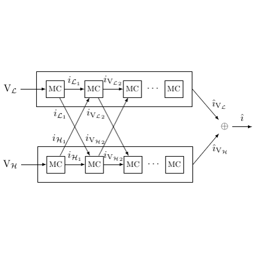

# test_9.png



# 1. Overview
The image shows a block diagram of two parallel signal processing chains labeled V_L and V_H, each containing multiple "MC" blocks connected in series. The chains have cross-connections between specific blocks, with signals labeled i_L, iv_L, i_H, iv_H, etc. The outputs combine with an XOR operation, producing a final output i.

# 2. Document Skeleton & Dependencies
```latex
\documentclass{article}
\usepackage{tikz}
\usetikzlibrary{positioning, arrows.meta, calc, circuits.logic.US}
\usepackage{amsmath}
\usepackage{amssymb}
```

# 3. Layout & Canvas Settings
```latex
\begin{tikzpicture}[
  node distance=0.8cm,
  box/.style={draw, minimum size=0.8cm},
  >=Latex
]
```

# 4. Fonts & Colors
All elements appear to use standard black color for lines and text. The diagram uses standard math italic font for variables and subscripts.

# 5. Structure & Component Styles
- Two horizontal rectangular boxes containing MC blocks
- Square MC blocks arranged in series within each box
- Directional arrows connecting blocks
- Cross-connections between the two chains
- XOR gate symbol at the output
- Input/output labels

# 6. Math/Graphic Details
- Subscript notation for variables (L, H)
- Superscript notation for some variables (iv)
- XOR symbol (⊕) at the output junction

# 7. Custom Macros & Commands
```latex
\tikzset{
  mc block/.style={draw, minimum size=0.8cm, inner sep=1pt},
  signal line/.style={->, >=Latex},
  box container/.style={draw, inner sep=6pt}
}
```

# 8. MWE (Minimum Working Example)
```latex
\documentclass{article}
\usepackage{tikz}
\usetikzlibrary{positioning, arrows.meta, calc, circuits.logic.US}
\usepackage{amsmath}

\begin{document}

\begin{tikzpicture}[
  node distance=0.8cm,
  mc block/.style={draw, minimum size=0.8cm, inner sep=1pt},
  signal line/.style={->, >=Latex},
  box container/.style={draw, inner sep=6pt}
]

% Top row (V_L)
\node[left] (VL) {$\mathrm{V}_{\mathcal{L}}$};
\node[mc block, right=0.5cm of VL] (MC1) {MC};
\node[mc block, right=0.5cm of MC1] (MC2) {MC};
\node[mc block, right=0.5cm of MC2] (MC3) {MC};
\node[right=0.3cm of MC3] (dots1) {$\cdots$};
\node[mc block, right=0.3cm of dots1] (MC4) {MC};

% Bottom row (V_H)
\node[left] (VH) at ($(VL) + (0,-3cm)$) {$\mathrm{V}_{\mathcal{H}}$};
\node[mc block, right=0.5cm of VH] (MCH1) {MC};
\node[mc block, right=0.5cm of MCH1] (MCH2) {MC};
\node[mc block, right=0.5cm of MCH2] (MCH3) {MC};
\node[right=0.3cm of MCH3] (dots2) {$\cdots$};
\node[mc block, right=0.3cm of dots2] (MCH4) {MC};

% Box containers
\node[box container, fit=(MC1) (MC2) (MC3) (MC4) (dots1), inner sep=10pt] {};
\node[box container, fit=(MCH1) (MCH2) (MCH3) (MCH4) (dots2), inner sep=10pt] {};

% Connections in top row
\draw[signal line] (VL) -- (MC1);
\draw[signal line] (MC1) -- (MC2) node[midway, above] {$i_{\mathcal{L}}$};
\draw[signal line] (MC2) -- (MC3) node[midway, above] {$iv_{\mathcal{L}}$};
\draw[signal line] (MC3) -- (dots1);
\draw[signal line] (dots1) -- (MC4);

% Connections in bottom row
\draw[signal line] (VH) -- (MCH1);
\draw[signal line] (MCH1) -- (MCH2) node[midway, above] {$i_{\mathcal{H}_1}$};
\draw[signal line] (MCH2) -- (MCH3) node[midway, above] {$iv_{\mathcal{H}_2}$};
\draw[signal line] (MCH3) -- (dots2);
\draw[signal line] (dots2) -- (MCH4);

% Cross connections
\draw[signal line] ($(MC1.south) + (0.2,0)$) -- node[right, pos=0.2] {$i_{\mathcal{L}}$} ($(MCH2.north) + (-0.2,0)$);
\draw[signal line] ($(MC2.south) + (0.2,0)$) -- node[right, pos=0.2] {$iv_{\mathcal{L}_2}$} ($(MCH3.north) + (-0.2,0)$);
\draw[signal line] ($(MCH1.north) + (0.2,0)$) -- node[left, pos=0.2] {$i_{\mathcal{H}_1}$} ($(MC2.south) + (-0.2,0)$);
\draw[signal line] ($(MCH2.north) + (0.2,0)$) -- node[left, pos=0.2] {$iv_{\mathcal{H}_2}$} ($(MC3.south) + (-0.2,0)$);

% Output
\node[right=1.5cm of MC4] (xor) {$\oplus$};
\node[right=0.8cm of xor] (out) {$i$};

\draw[signal line] (MC4) -- node[above, pos=0.7] {$iv_{\mathcal{L}}$} (xor);
\draw[signal line] (MCH4) |- node[right, pos=0.25] {$iv_{\mathcal{H}}$} (xor);
\draw[signal line] (xor) -- (out);

\end{tikzpicture}

\end{document}
```

# 9. Replication Checklist
- Two parallel chains with MC blocks are properly aligned
- Cross-connections between specific blocks are correctly drawn
- All labels (i_L, iv_L, etc.) are properly positioned
- XOR gate at the output is correctly represented
- Arrows show the correct flow direction

# 10. Risks & Alternatives
- Exact spacing between elements might need adjustment
- The subscript notation might need fine-tuning (mathcal vs. regular)
- Alternative implementation could use a matrix of nodes for more precise alignment
- For complex cross-connections, the `to` path operation with `out` and `in` angles might provide better control
