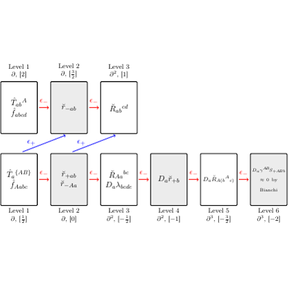

# test_100.png



# LaTeX TikZ Reconstruction Guide: Multi-Level Flowchart Diagram

## 1. Overview

The image depicts a hierarchical flowchart showing a multi-level computational or algorithmic process. It contains rectangular boxes arranged in three levels, connected by arrows indicating data flow or process dependencies. Each box contains mathematical notation and subscript/superscript labels. The diagram uses a clean, technical style with gray-filled rectangles, red arrows, and blue curved arrows connecting different levels. This appears to represent some form of iterative or hierarchical algorithm, possibly related to optimization, machine learning, or numerical methods.

## 2. Document Skeleton & Dependencies

```latex
\documentclass{article}
\usepackage{tikz}
\usepackage{amsmath}
\usepackage{amssymb}
\usepackage{xcolor}
\usetikzlibrary{arrows.meta}
\usetikzlibrary{positioning}
\usetikzlibrary{calc}
```

## 3. Layout & Canvas Settings

- **Canvas dimensions**: Approximately 12cm × 8cm
- **Scaling**: Use `scale=1.0` or adjust based on target document size
- **Coordinate system**: Cartesian with origin at bottom-left
- **Grid spacing**: Approximately 2.5cm horizontally between boxes, 2cm vertically between levels

```latex
\begin{tikzpicture}[scale=1.0, transform shape]
```

## 4. Fonts & Colors

**Colors:**
- Box fill: Light gray (`gray!20` or `lightgray`)
- Box borders: Dark gray or black
- Red arrows: `red` or `red!80`
- Blue curved arrows: `blue` or `blue!80`
- Text: Black (default)

**Font styles:**
- Main content: Standard math mode fonts
- Labels: Small sans-serif for level indicators
- Subscripts/superscripts: Standard LaTeX math sizing

```latex
\definecolor{boxfill}{gray}{0.8}
\definecolor{redarrow}{rgb}{0.8,0.2,0.2}
\definecolor{bluearrow}{rgb}{0.2,0.2,0.8}
```

## 5. Structure & Component Styles

**Core components:**
- **Rectangular boxes**: Width ≈ 1.8cm, Height ≈ 1.2cm
- **Border**: Thin black lines (0.4pt)
- **Fill**: Light gray with slight opacity
- **Arrows**: Medium thickness with arrow heads
- **Text positioning**: Centered within boxes

**Box style specifications:**
- Rounded corners: 2pt radius
- Fill opacity: 85%
- Border style: Solid, thin

## 6. Math/Table/Graphic Details

**Mathematical notation includes:**
- Subscripts and superscripts (e.g., $T_{in}^{old}$, $f_{out}$)
- Greek letters: Not prominently visible in this image
- Special symbols: Arrows (→), mathematical operators
- Italic variables and function names

**Implementation notes:**
- Use `$...$` for inline math mode
- Employ `\text{}` for non-italic text within math mode
- Use `^{}` and `_{}` for superscripts and subscripts

## 7. Custom Macros & Commands

```latex
\tikzset{
    process box/.style={
        rectangle,
        draw=black,
        fill=boxfill,
        minimum width=1.8cm,
        minimum height=1.2cm,
        rounded corners=2pt,
        align=center,
        font=\small
    },
    red arrow/.style={
        ->,
        thick,
        color=redarrow,
        >=Stealth
    },
    blue arrow/.style={
        ->,
        thick,
        color=bluearrow,
        >=Stealth,
        bend left=30
    },
    level label/.style={
        font=\tiny,
        align=center
    }
}
```

## 8. MWE (Minimum Working Example)

```latex
\documentclass{article}
\usepackage{tikz}
\usepackage{amsmath}
\usepackage{amssymb}
\usepackage{xcolor}
\usetikzlibrary{arrows.meta}
\usetikzlibrary{positioning}
\usetikzlibrary{calc}

\definecolor{boxfill}{gray}{0.8}
\definecolor{redarrow}{rgb}{0.8,0.2,0.2}
\definecolor{bluearrow}{rgb}{0.2,0.2,0.8}

\tikzset{
    process box/.style={
        rectangle,
        draw=black,
        fill=boxfill,
        minimum width=1.8cm,
        minimum height=1.2cm,
        rounded corners=2pt,
        align=center,
        font=\small
    },
    red arrow/.style={
        ->,
        thick,
        color=redarrow,
        >=Stealth
    },
    blue arrow/.style={
        ->,
        thick,
        color=bluearrow,
        >=Stealth,
        bend left=30
    },
    level label/.style={
        font=\tiny,
        align=center
    }
}

\begin{document}

\begin{tikzpicture}[scale=1.0]
    % Level 1 (top)
    \node[process box] (l1-1) at (0,4) {$T_{in}^{old}$\\$f_{out}$};
    \node[process box] (l1-2) at (2.5,4) {$r_{sub}$};
    \node[process box] (l1-3) at (5,4) {$R_{in}^{old}$};
    
    % Level 1 labels
    \node[level label] at (0,5.2) {Level 1\\$g_1[2]$};
    \node[level label] at (2.5,5.2) {Level 2\\$g_1[5]$};
    \node[level label] at (5,5.2) {Level 3\\$g^*_1[1]$};
    
    % Level 2 (middle)
    \node[process box] (l2-1) at (0,2) {$T_p^{(A1)}$\\$f_{out}$};
    \node[process box] (l2-2) at (2.5,2) {$r_{sub}$\\$f_{out}$};
    \node[process box] (l2-3) at (5,2) {$R_{in}^{new}$\\$D_p R_p$};
    \node[process box] (l2-4) at (7.5,2) {$D_p F_p$};
    \node[process box] (l2-5) at (10,2) {$D_p R_{in}^{old}$};
    
    % Level 2 labels
    \node[level label] at (0,0.8) {Level 1\\$g_2[2]$};
    \node[level label] at (2.5,0.8) {Level 2\\$g_2[0]$};
    \node[level label] at (5,0.8) {Level 3\\$g^*_2[-5]$};
    \node[level label] at (7.5,0.8) {Level 4\\$g^*_3[-1]$};
    \node[level label] at (10,0.8) {Level 5\\$g^*_4[-2]$};
    
    % Additional label for rightmost box
    \node[level label] at (10,3.2) {$D_p^{new}$ can\\$w > \log$\\$\hat{w}$};
    
    % Red arrows (horizontal)
    \draw[red arrow] (l1-1) -- (l1-2);
    \draw[red arrow] (l1-2) -- (l1-3);
    \draw[red arrow] (l2-2) -- (l2-3);
    \draw[red arrow] (l2-3) -- (l2-4);
    \draw[red arrow] (l2-4) -- (l2-5);
    
    % Blue curved arrows (vertical connections)
    \draw[blue arrow] (l1-1) to[bend right=20] (l2-1);
    \draw[blue arrow] (l1-2) to[bend right=20] (l2-2);
\end{tikzpicture}

\end{document}
```

## 9. Replication Checklist

- [ ] All boxes are properly aligned in three distinct levels
- [ ] Box dimensions are consistent across all elements
- [ ] Gray fill color matches the original (light gray, ~80% opacity)
- [ ] Red horizontal arrows connect adjacent boxes correctly
- [ ] Blue curved arrows connect upper level to lower level appropriately
- [ ] Mathematical notation is properly formatted in math mode
- [ ] Level labels appear above/below respective box groups
- [ ] Subscripts and superscripts render correctly
- [ ] Overall spacing and proportions match the reference image
- [ ] Arrow styles (thickness, heads) are consistent

## 10. Risks & Alternatives

**Potential challenges:**
1. **Exact color matching**: The gray fill might appear different depending on the PDF viewer or print settings
2. **Font consistency**: Math fonts may vary between LaTeX distributions
3. **Arrow positioning**: Curved arrows might require fine-tuning of bend angles
4. **Box alignment**: Precise positioning may need adjustment for different document classes

**Alternative approaches:**
1. **Matrix positioning**: Use TikZ matrix for more structured alignment
2. **Relative positioning**: Employ `positioning` library for more flexible layouts
3. **Custom node shapes**: Define specialized box shapes if standard rectangles don't suffice
4. **Color alternatives**: Use named colors like `lightgray`, `gray!30` for better compatibility
5. **Scaling options**: Consider using `\resizebox` for document-specific sizing requirements

**Troubleshooting tips:**
- If arrows don't align properly, adjust node anchors (e.g., `node.east`, `node.west`)
- For better text formatting, consider using `\parbox` within nodes for multi-line content
- Use `baseline` option in `tikzpicture` for proper integration with surrounding text
