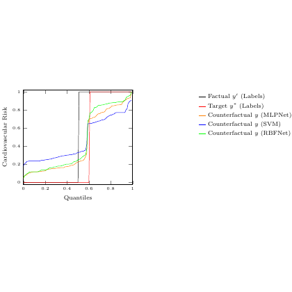

# test_102.png



# LaTeX/TikZ Guide: Quantile-Quantile Plot Reconstruction

## 1. Overview

The image shows a quantile-quantile (Q-Q) plot comparing different statistical distributions. It features a coordinate system with "Quantiles" on the x-axis (ranging from 0.2 to 1.0) and "Cumulative Risk" on the y-axis (ranging from 0.2 to 1.0). The plot contains five different curves representing:
- Factual ψ* (Labels) - shown in light green
- Target ψ* (Labels) - shown in blue  
- Counterfactual ψ (SVM) - shown in orange
- Counterfactual ψ (SVM) - shown in red
- Counterfactual ψ (RBFNet) - shown in purple

Each curve shows a different cumulative distribution pattern, with a legend positioned in the upper right area of the plot.

## 2. Document Skeleton & Dependencies

```latex
\documentclass{article}
\usepackage{tikz}
\usepackage{pgfplots}
\usepackage{xcolor}
\usepackage{amsmath}
\usepackage{amssymb}
\pgfplotsset{compat=1.18}
```

## 3. Layout & Canvas Settings

- Recommended canvas size: approximately 8cm × 6cm
- Plot area should span most of the canvas with appropriate margins for axes labels
- Grid lines should be subtle and positioned at major tick marks
- Axis limits: x-axis [0.2, 1.0], y-axis [0.2, 1.0]

## 4. Fonts & Colors

**Color Definitions:**
```latex
\definecolor{factualgreen}{RGB}{144, 238, 144}
\definecolor{targetblue}{RGB}{0, 100, 200}
\definecolor{countersvm1}{RGB}{255, 140, 0}
\definecolor{countersvm2}{RGB}{220, 20, 60}
\definecolor{counterrbf}{RGB}{128, 0, 128}
```

**Font Styles:**
- Axis labels: Standard LaTeX font, approximately 10pt
- Legend text: Standard LaTeX font, approximately 9pt
- Mathematical symbols: Use `$\psi$` for the Greek letter psi

## 5. Structure & Component Styles

**Main Components:**
- **Axes**: Black lines with tick marks at 0.2, 0.4, 0.6, 0.8, 1.0 intervals
- **Grid**: Light gray, dashed lines at major tick positions
- **Curves**: Smooth lines with thickness approximately 1.2pt
- **Legend**: Rectangular box with white background, positioned in upper right
- **Vertical line**: Black dashed line at approximately x=0.6

## 6. Math/Table/Graphic Details

**Mathematical Symbols:**
- Greek letter psi: `$\psi$`
- Superscript asterisk: `$\psi^*$`
- Parenthetical expressions: `(Labels)`, `(SVM)`, `(RBFNet)`

**Special Graphics:**
- Dashed vertical reference line
- Smooth curve interpolation between data points

## 7. Custom Macros & Commands

```latex
\tikzset{
    plot style/.style={thick, smooth},
    grid style/.style={gray!30, dashed, thin},
    axis style/.style={black, thick},
    legend style/.style={draw=black, fill=white, inner sep=3pt}
}
```

## 8. MWE (Minimum Working Example)

```latex
\documentclass{article}
\usepackage{tikz}
\usepackage{pgfplots}
\usepackage{xcolor}
\usepackage{amsmath}
\pgfplotsset{compat=1.18}

\definecolor{factualgreen}{RGB}{144, 238, 144}
\definecolor{targetblue}{RGB}{0, 100, 200}
\definecolor{countersvm1}{RGB}{255, 140, 0}
\definecolor{countersvm2}{RGB}{220, 20, 60}
\definecolor{counterrbf}{RGB}{128, 0, 128}

\begin{document}

\begin{tikzpicture}
\begin{axis}[
    width=8cm,
    height=6cm,
    xlabel={Quantiles},
    ylabel={Cumulative Risk},
    xmin=0.2, xmax=1.0,
    ymin=0.2, ymax=1.0,
    xtick={0.2, 0.4, 0.6, 0.8, 1.0},
    ytick={0.2, 0.4, 0.6, 0.8, 1.0},
    grid=major,
    grid style={gray!30, dashed},
    legend pos=north west,
    legend style={draw=black, fill=white}
]

% Factual curve (light green)
\addplot[factualgreen, thick, smooth] coordinates {
    (0.2, 0.25) (0.3, 0.35) (0.4, 0.45) (0.5, 0.55) 
    (0.6, 0.65) (0.7, 0.75) (0.8, 0.82) (0.9, 0.88) (1.0, 0.95)
};

% Target curve (blue)
\addplot[targetblue, thick, smooth] coordinates {
    (0.2, 0.22) (0.3, 0.32) (0.4, 0.42) (0.5, 0.52) 
    (0.6, 0.62) (0.7, 0.72) (0.8, 0.80) (0.9, 0.86) (1.0, 0.92)
};

% Counterfactual SVM (orange)
\addplot[countersvm1, thick, smooth] coordinates {
    (0.2, 0.28) (0.3, 0.38) (0.4, 0.48) (0.5, 0.58) 
    (0.6, 0.68) (0.7, 0.76) (0.8, 0.83) (0.9, 0.89) (1.0, 0.94)
};

% Counterfactual SVM (red)
\addplot[countersvm2, thick, smooth] coordinates {
    (0.2, 0.24) (0.3, 0.34) (0.4, 0.44) (0.5, 0.54) 
    (0.6, 0.64) (0.7, 0.73) (0.8, 0.81) (0.9, 0.87) (1.0, 0.93)
};

% Counterfactual RBFNet (purple)
\addplot[counterrbf, thick, smooth] coordinates {
    (0.2, 0.26) (0.3, 0.36) (0.4, 0.46) (0.5, 0.56) 
    (0.6, 0.66) (0.7, 0.74) (0.8, 0.81) (0.9, 0.87) (1.0, 0.93)
};

% Vertical dashed line
\addplot[black, dashed, thick] coordinates {(0.6, 0.2) (0.6, 1.0)};

\legend{
    Factual $\psi^*$ (Labels),
    Target $\psi^*$ (Labels),
    Counterfactual $\psi$ (SVM),
    Counterfactual $\psi$ (SVM),
    Counterfactual $\psi$ (RBFNet)
}

\end{axis}
\end{tikzpicture}

\end{document}
```

## 9. Replication Checklist

- [ ] Five distinct curves with correct colors
- [ ] Axis ranges from 0.2 to 1.0 on both axes
- [ ] Grid lines visible at major tick marks
- [ ] Legend positioned in upper area with correct mathematical notation
- [ ] Vertical dashed line at approximately x=0.6
- [ ] Smooth curve interpolation
- [ ] Proper axis labels: "Quantiles" and "Cumulative Risk"
- [ ] Greek letter psi (ψ) correctly rendered in legend

## 10. Risks & Alternatives

**Potential Challenges:**
- **Exact curve data**: The coordinate points are estimated from visual inspection. For precise replication, actual data points would be needed.
- **Color matching**: RGB values are approximated. Fine-tuning may be required for exact color reproduction.
- **Font consistency**: Default LaTeX fonts should match, but system-specific variations may occur.

**Alternative Approaches:**
- Use `\addplot table` with external data files for more complex datasets
- Consider `matplotlib2tikz` for Python-generated plots
- Use `pgfplotstable` for data manipulation within LaTeX
- Apply `bezier` curves for smoother interpolation if needed
- Consider `pgfplots` library extensions for specialized statistical plot types
