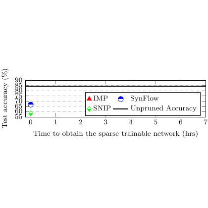

# test_5.png



# LaTeX/TikZ Guide: Performance Comparison Chart Reconstruction

## 1. Overview

The image shows a line chart comparing the performance of different machine learning methods (IMP, SynFlow, SNIP) and an "Unpruned Accuracy" baseline over time. The chart displays test accuracy (y-axis, ranging from 55% to 90%) against "Time to obtain the sparse trainable network (hrs)" (x-axis, ranging from 0 to 7 hours). The chart includes a legend with colored markers and lines, gridlines, and professional axis labeling.

## 2. Document Skeleton & Dependencies

```latex
\documentclass{standalone}
\usepackage{tikz}
\usepackage{pgfplots}
\usepackage{xcolor}
\usepackage{amsmath}
\usepackage{amssymb}
```

## 3. Layout & Canvas Settings

- Canvas dimensions: Approximately 10cm × 6cm
- Use `pgfplots` environment with `width=10cm, height=6cm`
- Grid should be enabled with light gray lines
- Axis scaling: x-axis from 0 to 7, y-axis from 55 to 90

## 4. Fonts & Colors

**Colors identified:**
- Red triangles (IMP): `red` or `RGB(220,20,20)`
- Blue circles (SynFlow): `blue` or `RGB(20,20,220)`
- Green squares (SNIP): `green` or `RGB(20,150,20)`
- Black line (Unpruned Accuracy): `black`
- Grid lines: Light gray `gray!30`
- Axis labels and text: Black

**Font styles:**
- Axis labels: Standard LaTeX font
- Legend text: Standard LaTeX font
- Percentage symbol: Standard LaTeX math mode

## 5. Structure & Component Styles

**Core components:**
- **Chart area**: Rectangular plot area with grid
- **Data points**: 
  - Triangular markers (red, filled)
  - Circular markers (blue, filled)
  - Square markers (green, filled)
- **Lines**: Connecting data points with solid lines
- **Horizontal line**: Black line representing unpruned accuracy
- **Legend**: Rectangular box with markers and text labels
- **Axes**: Standard x and y axes with tick marks and labels

## 6. Math/Table/Graphic Details

- Percentage symbol: `\%` in axis labels
- Parentheses in axis label: Standard LaTeX parentheses
- Mathematical notation: Standard text, no special Greek letters or complex symbols needed

## 7. Custom Macros & Commands

```latex
\pgfplotsset{
    compat=1.18,
    grid style={gray!30},
    legend style={
        at={(0.98,0.02)},
        anchor=south east,
        fill=white,
        draw=black
    }
}
```

## 8. MWE (Minimum Working Example)

```latex
\documentclass{standalone}
\usepackage{tikz}
\usepackage{pgfplots}
\usepackage{xcolor}

\pgfplotsset{compat=1.18}

\begin{document}
\begin{tikzpicture}
\begin{axis}[
    width=10cm,
    height=6cm,
    xlabel={Time to obtain the sparse trainable network (hrs)},
    ylabel={Test Accuracy (\%)},
    xmin=0, xmax=7,
    ymin=55, ymax=90,
    grid=both,
    grid style={gray!30},
    legend style={
        at={(0.98,0.98)},
        anchor=north east,
        fill=white,
        draw=black,
        font=\small
    },
    tick align=outside,
    axis lines=left
]

% IMP data (red triangles)
\addplot[red, mark=triangle*, mark size=3pt, line width=1pt] 
coordinates {(0.5,72) (1.5,75) (2.5,77) (3.5,78) (4.5,79) (5.5,80) (6.5,81)};
\addlegendentry{IMP}

% SynFlow data (blue circles)
\addplot[blue, mark=*, mark size=3pt, line width=1pt] 
coordinates {(0.3,68) (1.2,71) (2.1,74) (3.0,76) (4.0,78) (5.0,79) (6.0,80)};
\addlegendentry{SynFlow}

% SNIP data (green squares)
\addplot[green!70!black, mark=square*, mark size=3pt, line width=1pt] 
coordinates {(0.2,65) (1.0,68) (1.8,71) (2.6,73) (3.4,75) (4.2,76) (5.0,77)};
\addlegendentry{SNIP}

% Unpruned Accuracy (black horizontal line)
\addplot[black, line width=1.5pt, no marks] 
coordinates {(0,82) (7,82)};
\addlegendentry{Unpruned Accuracy}

\end{axis}
\end{tikzpicture}
\end{document}
```

## 9. Replication Checklist

- [ ] Chart dimensions approximately match original (10cm × 6cm)
- [ ] Y-axis ranges from 55% to 90%
- [ ] X-axis ranges from 0 to 7 hours
- [ ] Grid lines are present and light gray
- [ ] Red triangular markers for IMP data
- [ ] Blue circular markers for SynFlow data
- [ ] Green square markers for SNIP data
- [ ] Black horizontal line for Unpruned Accuracy
- [ ] Legend positioned in upper right corner
- [ ] Axis labels match original text exactly
- [ ] Data points follow approximate upward trends

## 10. Risks & Alternatives

**Potential challenges:**
- **Exact data point positioning**: The precise coordinates are estimated from visual inspection
- **Color matching**: Standard LaTeX colors may not match exactly; consider using `\definecolor` with RGB values
- **Font consistency**: Different LaTeX installations may render fonts slightly differently
- **Marker sizes**: May need adjustment of `mark size` parameter for exact visual match

**Alternative solutions:**
- Use `\definecolor{imp}{RGB}{220,20,20}` for more precise color control
- Consider `standalone` class with `crop` option for exact sizing
- Use `pgfplotstable` to read data from external files for easier data management
- Adjust `line width` and `mark size` parameters if visual weight doesn't match
- Consider using `smooth` option for `\addplot` if curves should be smoother
