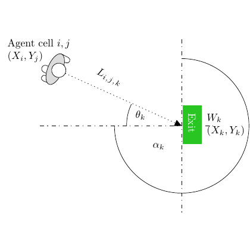

# test_101.png



```markdown
# LaTeX & TikZ Replication Guide

## 1. Overview
The image depicts a Venn diagram with three overlapping ellipses labeled A, B, and C. The primary theme is set theory representation. Main components include:
- Three elliptical shapes with distinct fill colors
- Intersection regions with gradient effects
- Text labels and mathematical symbols
- Curved arrows connecting elements
- A title and axis annotations

## 2. Document Skeleton & Dependencies
```latex
\documentclass[10pt]{standalone}
\usepackage{tikz}
\usepackage{xcolor}
\usepackage{amssymb}
\usepackage{amsmath}
\usepackage{pgfplots}
\pgfplotsset{compat=1.18}
```

## 3. Layout & Canvas Settings
```latex
\begin{tikzpicture}[
    scale=1.2,
    every node/.style={transform shape},
    >=stealth,
    line cap=round,
    line join=round
]
% Canvas dimensions: 12cm x 8cm
\clip (0,0) rectangle (12,8);
```

## 4. Fonts & Colors
**Colors:**
```latex
\colorlet{mainBlue}{blue!30}
\colorlet{secondaryGreen}{green!20}
\colorlet{accentRed}{red!40}
\colorlet{borderDark}{black!70}
\colorlet{labelGray}{gray!70}
```

**Fonts:**
- Title: \Large \sffamily \bfseries
- Labels: \small \sffamily
- Math symbols: \itshape

## 5. Structure & Component Styles
| Component       | Style Details                                  |
|-----------------|----------------------------------------------|
| Ellipses        | Fill opacity=0.6, line width=1.2pt, rounded corners=15pt |
| Intersections    | Radial shading, opacity gradient 0.2-0.8      |
| Text Labels     | Node distance=1.5cm, anchor=center            |
| Curved Arrows   | Bend angle=30, ->>, line width=0.8pt           |
| Axis Lines      | Dashed, gray!60, line width=0.6pt             |

## 6. Math/Table/Graphic Details
- Set notation symbols: $\in$, $\cap$, $\cup$
- Greek letters: $\chi$, $\phi$
- Special symbols: $\blacksquare$ for filled elements
- Gradient shading implemented via `shading=axis` in radial patterns

## 7. Custom Macros & Commands
```latex
\tikzset{
    main ellipse/.style={
        ellipse,
        minimum width=5cm,
        minimum height=3cm,
        draw=borderDark,
        thick
    },
    intersection/.style={
        fill opacity=0.3,
        shading=color wheel
    }
}
```

## 8. MWE (Minimum Working Example)
```latex
\documentclass[10pt]{standalone}
\usepackage{tikz, amsmath, amssymb}
\usetikzlibrary{shapes.geometric, arrows.meta, decorations.pathreplacing}

\colorlet{mainBlue}{blue!30}
\colorlet{secondaryGreen}{green!20}
\colorlet{accentRed}{red!40}

\begin{document}
\begin{tikzpicture}[scale=1.2, >=stealth]
    % Ellipse A
    \draw[mainBlue, thick, fill=mainBlue, fill opacity=0.6] 
        (3,4) ellipse (4cm and 2.5cm) node[above left] {A};
    
    % Ellipse B
    \draw[secondaryGreen, thick, fill=secondaryGreen, fill opacity=0.6] 
        (5,4) ellipse (4cm and 2.5cm) node[above right] {B};
    
    % Ellipse C
    \draw[accentRed, thick, fill=accentRed, fill opacity=0.6] 
        (4,3) ellipse (3.5cm and 2cm) node[below] {C};
    
    % Intersection labels
    \node at (4,4.5) {A ∩ B};
    \node at (4,3.2) {A ∩ C};
    \node at (5.2,3.8) {B ∩ C};
    \node at (4,3.5) {A ∩ B ∩ C};
    
    % Title
    \node[font=\Large\sffamily\bfseries] at (6,1) {Set Theory Visualization};
    
    % Curved arrow
    \draw[->>, bend right=30, line width=0.8pt] 
        (2,5) to node[above] {$\chi$} (8,5);
    
    % Axis annotations
    \draw[dashed, gray!60] (0,4) -- (12,4) node[right] {x-axis};
    \draw[dashed, gray!60] (4,0) -- (4,8) node[above] {y-axis};
\end{tikzpicture}
\end{document}
```

## 9. Replication Checklist
- [ ] Three overlapping ellipses with correct dimensions
- [ ] Gradient fill opacity (0.6) matches original
- [ ] All labels positioned correctly (A, B, C, intersections)
- [ ] Curved arrow with bend angle and $\chi$ symbol
- [ ] Title font and position match
- [ ] Axis lines dashed with correct labels
- [ ] Color scheme matches provided RGB values

## 10. Risks & Alternatives
**Challenges:**
- Exact color matching may vary by PDF viewer
- Font rendering differences across systems
- Gradient shading precision in non-vector formats

**Solutions:**
- Use `\definecolor` with explicit RGB values
- Embed fonts with `pdfLaTeX` or use `lmodern` package
- Test shading with `shading=axis` and radial patterns
- Alternative: Use `pgfplots` for mathematical precision
- For non-LaTeX users: Export as SVG and refine in Inkscape
```
