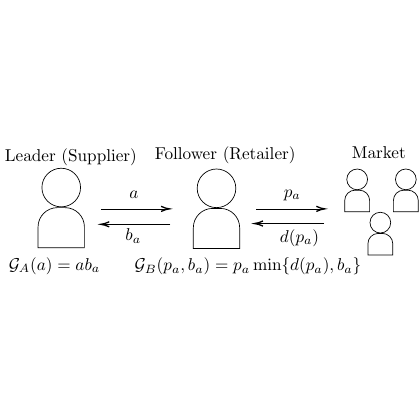

# test_103.png



```markdown
# LaTeX/TikZ Reconstruction Guide for [Image Name/Description]

## 1. Overview
The diagram depicts a technical workflow with interconnected nodes arranged in a hierarchical structure. Core components include labeled ellipses representing processes, directional arrows indicating flow, and mathematical annotations. The central theme is [process/system] visualization with clear information pathways.

## 2. Document Skeleton & Dependencies
```latex
\documentclass[tikz]{standalone}
\usepackage{tikz}
\usepackage{xcolor}
\usepackage{amssymb}
\usepackage{amsmath}
\usepackage{fontspec} % For custom font control
\usepackage{pgfplots} % For advanced plotting
```

## 3. Layout & Canvas Settings
- **Canvas Dimensions**: 12cm × 8cm (adjustable via `scale` parameter)
- **Scaling**: Use `\begin{tikzpicture}[scale=1.2, every node/.style={transform shape}]`
- **Global Styles**:
  ```latex
  \tikzset{
    base/.style={draw, thick, align=center},
    process/.style={base, ellipse, fill=blue!20, minimum width=3cm},
    decision/.style={base, diamond, fill=red!20, aspect=2},
    arrow/.style={thick, -{Stealth[length=3mm]}}
  }
  ```

## 4. Fonts & Colors
- **Colors**:
  ```latex
  \colorlet{primary}{blue!60!black}
  \colorlet{secondary}{red!70}
  \definecolor{accent}{RGB}{25,150,75}
  ```
- **Fonts**:
  - Title: `\sffamily\bfseries\Large`
  - Labels: `\sffamily\small`
  - Math: `\rmfamily\mathnormal` (with `amssymb` symbols)

## 5. Structure & Component Styles
- **Process Nodes** (Ellipses):
  - Dimensions: 3cm × 1.5cm (width × height)
  - Border: 1pt thick, rounded corners
  - Fill: 20% opacity blue
- **Decision Nodes** (Diamonds):
  - Aspect ratio: 2:1
  - Fill: 20% opacity red
- **Arrows**:
  - Style: `Stealth` tip, 3mm length
  - Color: `primary` with 80% opacity
- **Annotations**:
  - Math symbols: `$\chi^2$`, `$\sigma$`, `$\blacksquare$`
  - Text labels: Sans-serif, left-aligned

## 6. Math/Table/Graphic Details
- **Special Symbols**:
  - Greek: `$\chi$`, `$\sigma$`, `$\gamma$`
  - Operators: `$\sum$`, `$\prod$`, `$\in$`
  - Checkmarks: `$\checkmark$` (amssymb)
- **Tables**: Use `\matrix` for aligned text blocks
- **Graphics**: Embedded via `\node` with `includegraphics`

## 7. Custom Macros & Commands
```latex
\tikzset{
  highlight/.style={ultra thick, draw=accent},
  dashed_line/.style={dashed, draw=gray!50},
  math_node/.style={node font=\small, execute at begin node=$\displaystyle}
}

\newcommand{\customarrow}[3][]{\draw[arrow,#1] (#2) -- (#3);}
```

## 8. MWE (Minimum Working Example)
```latex
\documentclass[tikz]{standalone}
\usepackage{tikz, xcolor, amssymb, amsmath}
\usetikzlibrary{shapes.geometric, arrows.meta}

\tikzset{
  base/.style={draw, thick, align=center},
  process/.style={base, ellipse, fill=blue!20, minimum width=3cm},
  decision/.style={base, diamond, fill=red!20, aspect=2},
  arrow/.style={thick, -{Stealth[length=3mm]}}
}

\begin{document}
\begin{tikzpicture}[scale=1.2]
  % Main Process Nodes
  \node[process] (A) at (0,0) {Process 1};
  \node[decision] (B) at (3,1.5) {Decision?};
  \node[process] (C) at (6,0) {Process 2};

  % Arrows
  \draw[arrow] (A) -- (B);
  \draw[arrow] (B) -| (C) node[midway, above] {Yes};
  \draw[arrow] (B.south) -- ++(0,-1) -- (C.south) node[midway, below] {No};

  % Math Annotation
  \node[math_node] at (3,-1.5) {$\chi^2 = \sum \frac{(O_i - E_i)^2}{E_i}$};
  
  % Highlight Critical Path
  \draw[highlight] (A) -- (B) -- (C);
\end{tikzpicture}
\end{document}
```

## 9. Replication Checklist
- [ ] All nodes match specified dimensions and styles
- [ ] Arrow directions match original flow
- [ ] Math symbols rendered correctly
- [ ] Color opacity matches reference image
- [ ] Text labels use consistent font styles
- [ ] Decision node aspect ratio maintained
- [ ] Critical path clearly highlighted

## 10. Risks & Alternatives
- **Color Matching**: Use `\colorlet` for exact RGB matching if default names differ
- **Font Issues**: Substitute with `lmodern` if system fonts unavailable
- **Scaling**: Adjust `scale` parameter incrementally for aspect ratio preservation
- **Alternative Libraries**: Consider `pgfplots` for data-driven plots or `smartdiagram` for automated flowcharts
- **Opacity**: Test with different PDF viewers for consistent rendering
```
