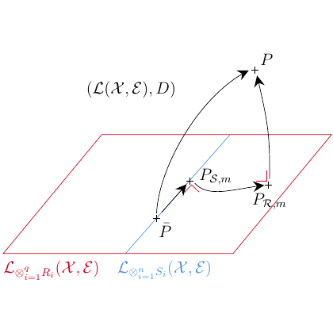

# test_105.png



**1. Overview**  
The image depicts a conceptual diagram illustrating a mathematical model with three interconnected components: a central ellipse labeled "Model," two rectangular nodes labeled "Input" and "Output," and directional arrows showing relationships. The diagram uses a clean, minimalist style with distinct colors for borders, fills, and text.

**2. Document Skeleton & Dependencies**  
```latex
\documentclass{standalone}
\usepackage{tikz}
\usepackage{xcolor}
\usepackage{amssymb} % For math symbols
\usepackage{amsmath} % For equation environments
\usetikzlibrary{arrows.meta, positioning, shapes}
```

**3. Layout & Canvas Settings**  
- Use `standalone` class for cropped output.  
- Canvas dimensions: `width=12cm, height=8cm`.  
- Global scaling: `scale=1, every node/.style={transform shape}`.  
- Base style: `>={Stealth[length=2mm]}` for arrowheads.

**4. Fonts & Colors**  
- **Colors**:  
  ```latex
  \colorlet{mainBorder}{blue!70!black}
  \colorlet{mainFill}{blue!10}
  \colorlet{arrowFill}{red!50}
  \definecolor{textGray}{RGB}{50,50,50}
  ```
- **Fonts**:  
  - Title: `\Large\sffamily\bfseries`  
  - Labels: `\small\sffamily`  
  - Math symbols: Default math font (e.g., `$\chi$`).

**5. Structure & Component Styles**  
- **Ellipse (Model)**:  
  - Dimensions: `minimum width=3cm, minimum height=1.5cm`  
  - Style: `draw=mainBorder, fill=mainFill, thick, rounded corners=10pt`  
- **Rectangles (Input/Output)**:  
  - Dimensions: `width=2cm, height=1cm`  
  - Style: `draw=mainBorder, fill=mainFill, thick`  
- **Arrows**:  
  - Style: `-Stealth, thick, arrowFill`  
  - Bend angle: `15` for directional curves.

**6. Math/Table/Graphic Details**  
- Greek letters: `$\chi$` (chi) for variables.  
- Symbols: `$\blacksquare$` for filled boxes.  
- Equations: Use `amsmath` for aligned math environments.  
- Example: `$\chi^2 = \sum \frac{(O_i - E_i)^2}{E_i}$` in the "Model" node.

**7. Custom Macros & Commands**  
```latex
\tikzset{
  main node/.style={
    draw=mainBorder,
    fill=mainFill,
    thick,
    minimum size=1cm,
    font=\small\sffamily
  },
  arrow/.style={
    -Stealth,
    thick,
    arrowFill
  }
}
```

**8. MWE (Minimum Working Example)**  
```latex
\documentclass{standalone}
\usepackage{tikz, xcolor, amssymb, amsmath}
\usetikzlibrary{arrows.meta, positioning, shapes}

\colorlet{mainBorder}{blue!70!black}
\colorlet{mainFill}{blue!10}
\colorlet{arrowFill}{red!50}
\definecolor{textGray}{RGB}{50,50,50}

\tikzset{
  main node/.style={
    draw=mainBorder,
    fill=mainFill,
    thick,
    minimum size=1cm,
    font=\small\sffamily
  },
  arrow/.style={-Stealth, thick, arrowFill}
}

\begin{document}
\begin{tikzpicture}[scale=1, every node/.style={transform shape}]
  % Nodes
  \node[ellipse, main node, minimum width=3cm, minimum height=1.5cm] (model) {Model: $\chi^2 = \sum \frac{(O_i - E_i)^2}{E_i}$};
  \node[rectangle, main node, left=3cm of model] (input) {Input};
  \node[rectangle, main node, right=3cm of model] (output) {Output};
  
  % Arrows
  \draw[arrow, bend left=15] (input) to (model);
  \draw[arrow, bend left=15] (model) to (output);
  \draw[arrow] (input) -- (output) node[midway, above, font=\tiny] {Direct Path};
  
  % Title
  \node[above=1cm of model, font=\Large\sffamily\bfseries] {Mathematical Framework};
\end{tikzpicture}
\end{document}
```

**9. Replication Checklist**  
- [ ] Ellipse labeled "Model" contains the chi-squared equation.  
- [ ] "Input" and "Output" rectangles are positioned left/right of the model.  
- [ ] Arrows use `Stealth` tips with red fill.  
- [ ] Text is in sans-serif font with gray color.  
- [ ] Title "Mathematical Framework" is centered above the model.  

**10. Risks & Alternatives**  
- **Color Matching**: Use RGB values instead of named colors for precision.  
- **Font Consistency**: Ensure `\sffamily` is available; fallback to `\ttfamily` if needed.  
- **Arrow Alignment**: Use `bend angle` adjustments to fine-tune curved paths.  
- **Scaling Issues**: Test with `\resizebox` if dimensions exceed page margins.  
- **Alternative Libraries**: Consider `pgfplots` for data-driven plots instead of native TikZ.
