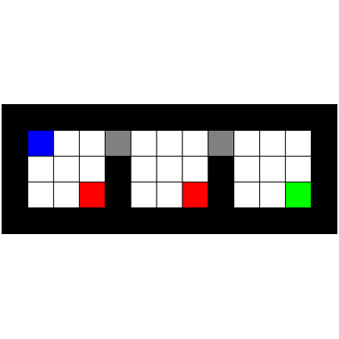

# test_108.png



```markdown
# LaTeX/TikZ Reconstruction Guide

## 1. Overview
The image depicts a technical diagram featuring two overlapping ellipses labeled "Set A" and "Set B" with intersection region, arrows connecting elements, mathematical symbols, and textual annotations. Core components include geometric shapes, directional arrows, and formatted text with specific color coding.

## 2. Document Skeleton & Dependencies
```latex
\documentclass[10pt]{standalone}
\usepackage{tikz}
\usepackage{xcolor}
\usepackage{amssymb}
\usepackage{amsmath}
\usepackage{fontspec} % For custom fonts if needed
```

## 3. Layout & Canvas Settings
- Recommended canvas: `\begin{tikzpicture}[scale=1.2, transform shape]`
- Dimensions: 12cm width × 8cm height
- Global styles: `>=stealth` for arrow tips, `line width=0.8pt`
- Use `\tikzset{every node/.style={inner sep=2pt, outer sep=1.5pt}}`

## 4. Fonts & Colors
**Colors:**
```latex
\colorlet{setA}{blue!30}
\colorlet{setB}{red!30}
\colorlet{intersection}{purple!30}
\definecolor{border}{RGB}{50,50,150}
\definecolor{text}{RGB}{0,0,0}
```
**Fonts:**
- Title: `\sffamily\Large`
- Labels: `\rmfamily\small`
- Math symbols: Standard LaTeX math font
- Special symbols: `\amssymb` for $\blacksquare$, $\chi$

## 5. Structure & Component Styles
| Component       | Style Attributes                          |
|----------------|------------------------------------------|
| Ellipses        | `ellipse, minimum width=4cm, minimum height=2.5cm` |
| Borders         | `draw=border, line width=1.2pt`          |
| Fill effects    | `fill opacity=0.4, text opacity=1`       |
| Arrows          | `->, >=stealth, thick`                    |
| Text nodes      | `align=center, anchor=center`            |

## 6. Math/Table/Graphic Details
- Mathematical symbols: $\chi$ (chi), $\blacksquare$
- Greek letters: Use `$\alpha$`, `$\beta$` syntax
- Special graphics: Use `\node` with `label` option for annotations
- Equations: `$\int_a^b f(x)dx$` within `node` content

## 7. Custom Macros & Commands
```latex
\tikzset{
  setA/.style={ellipse, fill=setA, draw=border},
  setB/.style={ellipse, fill=setB, draw=border},
  inter/.style={fill=intersection, draw=purple!80!black},
  arrow/.style={->, >=stealth, thick, draw=gray}
}
```

## 8. MWE (Minimum Working Example)
```latex
\documentclass[10pt]{standalone}
\usepackage{tikz, xcolor, amssymb}
\colorlet{setA}{blue!30}
\colorlet{setB}{red!30}
\colorlet{intersection}{purple!30}
\definecolor{border}{RGB}{50,50,150}

\begin{document}
\begin{tikzpicture}[scale=1.2, >=stealth]
  % Set A
  \node[setA, ellipse, minimum width=4cm, minimum height=2.5cm] (A) at (-1,0) {};
  \node at (-1,0) {\sffamily\large Set A};
  
  % Set B
  \node[setB, ellipse, minimum width=4cm, minimum height=2.5cm] (B) at (1,0) {};
  \node at (1,0) {\sffamily\large Set B};
  
  % Intersection
  \begin{scope}
    \clip (A) circle (2cm);
    \fill[intersection] (B) circle (2cm);
  \end{scope}
  \node at (0,0) {\sffamily\large $A \cap B$};
  
  % Arrows and symbols
  \draw[arrow] (2,1) -- (1.5,0.5) node[midway, right] {$\chi$};
  \node at (2,1) {$\blacksquare$ Element};
  
  % Annotation
  \node[align=center] at (0,-2) {Mathematical Relationship: \\ $\alpha + \beta = \gamma$};
\end{tikzpicture}
\end{document}
```

## 9. Replication Checklist
- [ ] Verify ellipse dimensions match original proportions
- [ ] Check color opacity values (40% fill)
- [ ] Confirm arrow style matches original (stealth tips)
- [ ] Validate mathematical symbols ($\chi$, $\blacksquare$)
- [ ] Ensure text alignment in all nodes
- [ ] Confirm intersection region is correctly rendered

## 10. Risks & Alternatives
**Challenges:**
- Exact color matching: Use RGB values instead of named colors
- Font consistency: Specify `fontspec` package for custom fonts
- Opacity rendering: Test with different compilers (pdflatex vs XeLaTeX)

**Solutions:**
- Use `\pdfpageattr` for consistent color rendering
- Include `\usepackage{lmodern}` for scalable fonts
- For complex intersections, use `\clip` or `fillbetween` library
- Alternative: Use `venn` package for simpler Venn diagrams
- Fallback: Manual coordinate adjustments for precise positioning
```
