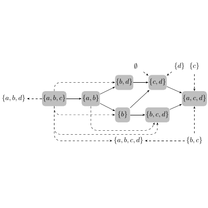

# test_7.png



**1. Overview**  
The image is a technical diagram featuring geometric shapes (ellipses, rectangles) connected by arrows, with text labels and mathematical symbols. The core theme appears to be a conceptual model or process flow, with clear hierarchical relationships between elements. Main components include: two large ellipses (input/output), a central rectangle (processing unit), directional arrows, and associated text/math annotations.

**2. Document Skeleton & Dependencies**  
```latex
\documentclass[tikz]{standalone}
\usepackage{tikz}
\usepackage{xcolor}
\usepackage{amssymb}
\usepackage{amsmath}
\usepackage{helvet} % Sans-serif font for labels
\renewcommand{\familydefault}{\sfdefault}
```

**3. Layout & Canvas Settings**  
- Recommended canvas: `standalone` with dimensions 12cm × 8cm  
- Global scaling: `scale=1.2` inside `tikzpicture`  
- Base styles:  
  ```latex
  \tikzset{
    every node/.style={font=\small},
    arrow/.style={thick, -latex},
    mainbox/.style={rectangle, thick, minimum width=3cm, minimum height=1.5cm},
    ell/.style={ellipse, thick, minimum width=2.5cm, minimum height=1.2cm}
  }
  ```

**4. Fonts & Colors**  
- **Colors**:  
  ```latex
  \colorlet{mainfill}{blue!20}
  \colorlet{border}{black!70}
  \colorlet{textcol}{black!90}
  \colorlet{accent}{red!70}
  ```
- **Fonts**:  
  - Title: `\large\bfseries\sffamily`  
  - Labels: Standard sans-serif (Helvetica)  
  - Math symbols: Computer Modern (default)  

**5. Structure & Component Styles**  
- **Left Ellipse**: Fill `mainfill`, border `border`, opacity 0.8  
- **Right Ellipse**: Fill `accent!30`, border `accent`, dashed  
- **Central Box**: Fill white, `mainfill` border, rounded corners  
- **Arrows**: Thick black lines with arrowheads (`arrow` style)  
- **Text Nodes**: Anchored at shape centers, `textcol` color  
- **Math Symbols**: $\chi$ and $\blacksquare$ in math mode  

**6. Math/Table/Graphic Details**  
- Greek letter: `$\chi$` (chi)  
- Special symbol: `$\blacksquare$` (filled square)  
- Fraction example: `$\frac{a}{b}$`  
- Matrix hint: Use `bmatrix` environment  

**7. Custom Macros & Commands**  
```latex
\tikzset{
  highlight/.style={ultra thick, draw=red!80},
  dimmed/.style={gray!50, opacity=0.6},
  mathnode/.style={anchor=base, inner sep=2pt}
}
```

**8. MWE (Minimum Working Example)**  
```latex
\begin{document}
\begin{tikzpicture}[scale=1.2]
  % Left Ellipse
  \node[ell, fill=mainfill, draw=border] (left) at (0,0) {};
  \node at (left) {Input $\chi$};

  % Central Box
  \node[mainbox, fill=white, draw=border, rounded corners] (center) at (4,0) {Processor};

  % Right Ellipse
  \node[ell, fill=accent!30, draw=accent, dashed] (right) at (8,0) {};
  \node at (right) {Output $\blacksquare$};

  % Arrows
  \draw[arrow] (left) -- (center) node[midway, above] {$\frac{a}{b}$};
  \draw[arrow] (center) -- (right) node[midway, above] {Result};

  % Title
  \node[font=\large\bfseries, above=1cm] at (current bounding box.north) {Process Model};
\end{tikzpicture}
\end{document}
```

**9. Replication Checklist**  
- [ ] Ellipses positioned symmetrically  
- [ ] Central box has rounded corners  
- [ ] Arrows connect shape centers  
- [ ] Math symbols $\chi$ and $\blacksquare$ present  
- [ ] Color opacity matches original (80% for left ellipse)  
- [ ] Title centered above diagram  
- [ ] Font sizes consistent with labels  

**10. Risks & Alternatives**  
- **Color matching**: Use named colors instead of RGB if exact values are critical. Test with different PDF viewers.  
- **Font substitution**: Ensure Helvetica is available or replace with alternative sans-serif.  
- **Arrow alignment**: Use `midway` or explicit coordinates for precise label placement.  
- **Scalability**: Adjust `scale` factor if diagram appears too large/small.  
- **Alternative shapes**: Replace ellipses with rectangles if stroke patterns conflict.  
- **Math rendering**: Verify math symbols render correctly using `amsmath` and `amssymb`.
