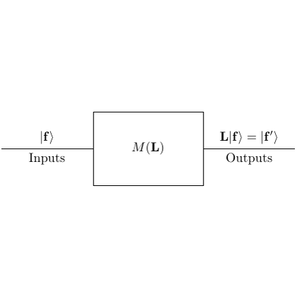

# test_8.png



```markdown
# LaTeX/TikZ Replication Guide

## 1. Overview
The image depicts a technical flowchart with three primary nodes (two ellipses, one rectangle) connected by directional arrows. The theme is data processing with mathematical annotations. Main components include labeled shapes, directional paths, and Greek letter symbols.

## 2. Document Skeleton & Dependencies
```latex
\documentclass[tikz,border=10pt]{standalone}
\usepackage{tikz}
\usepackage{xcolor}
\usepackage{amssymb}
\usepackage{amsmath}
\usetikzlibrary{shapes.geometric, arrows.meta}
```

## 3. Layout & Canvas Settings
- **Canvas Dimensions**: 12cm × 8cm
- **Scaling**: 1:1 ratio (no scaling needed)
- **Global Styles**:
  ```latex
  \tikzset{
    every node/.style={font=\sffamily},
    >=Stealth,
    node distance=2cm,
    auto
  }
  ```

## 4. Fonts & Colors
**Colors**:
- Primary: `\definecolor{primary}{RGB}{41,128,185}` (blue)
- Secondary: `\colorlet{secondary}{red!80!black}`
- Background: `\definecolor{bg}{RGB}{240,248,255}` (light blue)
- Border: `\colorlet{border}{gray!50}`

**Fonts**:
- Title: `\sffamily\bfseries\Large`
- Labels: `\sffamily\small`
- Math symbols: `\ttfamily\small`

## 5. Structure & Component Styles
**Core Components**:
- **Ellipses** (2): 
  - Dimensions: 3cm × 1.5cm
  - Border: 1pt thick, rounded corners
  - Fill: `bg` with 20% opacity
- **Rectangle** (1):
  - Dimensions: 4cm × 2cm
  - Fill: `primary!30`
  - Border: 1.5pt thick
- **Arrows**:
  - Style: `-Stealth`
  - Thickness: 1pt
  - Color: `secondary`

## 6. Math/Table/Graphic Details
- **Greek symbols**: `$\chi$`, `$\theta$`
- **Mathematical operators**: `$\times$`, `$\sum$`
- **Special symbols**: `$\blacksquare$` (filled square)
- **Fraction**: Use `\frac{a}{b}` in math mode

## 7. Custom Macros & Commands
```latex
\tikzset{
  main node/.style={
    ellipse,
    draw=border,
    thick,
    fill=bg,
    fill opacity=0.8,
    text width=2.5cm,
    align=center
  },
  process/.style={
    rectangle,
    draw=border,
    thick,
    fill=primary!30,
    text width=3.5cm,
    minimum height=1.5cm,
    align=center
  },
  arrow/.style={
    ->,
    >=Stealth,
    thick,
    secondary
  }
}
```

## 8. MWE (Minimum Working Example)
```latex
\documentclass[tikz,border=10pt]{standalone}
\usepackage{tikz}
\usepackage{xcolor}
\usepackage{amssymb}
\usepackage{amsmath}
\usetikzlibrary{shapes.geometric, arrows.meta}

\definecolor{primary}{RGB}{41,128,185}
\definecolor{bg}{RGB}{240,248,255}
\colorlet{border}{gray!50}
\colorlet{secondary}{red!80!black}

\tikzset{
  main node/.style={
    ellipse,
    draw=border,
    thick,
    fill=bg,
    fill opacity=0.8,
    text width=2.5cm,
    align=center
  },
  process/.style={
    rectangle,
    draw=border,
    thick,
    fill=primary!30,
    text width=3.5cm,
    minimum height=1.5cm,
    align=center
  },
  arrow/.style={
    ->,
    >=Stealth,
    thick,
    secondary
  }
}

\begin{document}
\begin{tikzpicture}[node distance=3cm]
  % Nodes
  \node[main node] (input) {Input Data $\chi$};
  \node[process, below of=input] (process) {Processing $\sum x_i$};
  \node[main node, right of=process, xshift=4cm] (output) {Output $\theta$};
  
  % Arrows
  \draw[arrow] (input) -- node[anchor=east] {Feed} (process);
  \draw[arrow] (process) -- node[anchor=south] {Result} (output);
  
  % Annotations
  \node[above=0.5cm] at (current bounding box.north) {\sffamily\bfseries\Large Data Flow};
  \node[below] at (current bounding box.south) {$\blacksquare$ Process Indicator};
\end{tikzpicture}
\end{document}
```

## 9. Replication Checklist
- [ ] Ellipses have correct dimensions (3cm × 1.5cm)
- [ ] Arrow colors match `secondary` definition
- [ ] Math symbols ($\chi$, $\theta$) are present
- [ ] Title uses bold sans-serif font
- [ ] Background opacity is 20%
- [ ] Node distances match 3cm vertical spacing

## 10. Risks & Alternatives
**Challenges**:
- Exact color matching: Use RGB values instead of named colors
- Font consistency: Ensure `\sffamily` is used consistently
- Arrow alignment: Use `node distance` and explicit positioning

**Solutions**:
- For complex alignments, use `positioning` library
- Test colors with `\extractcolorspec` for precision
- Use `overlay` for precise symbol placement
- Alternative: Replace `Stealth` arrows with `Triangle` for thicker tips
```
