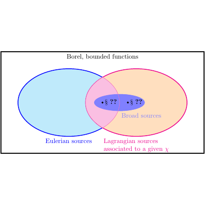

# test_0.png



**1. Overview**

The image is a Venn diagram with three overlapping regions, representing "Eulerian sources," "Lagrangian sources associated to a given χ," and "Broad sources." Each section is color-coded, with labeled regions, and contains math symbols in the intersection.

**2. Document Skeleton & Dependencies**

```latex
\documentclass{standalone}
\usepackage{tikz}
\usepackage{amsmath}
\usepackage{amssymb}
```

**3. Layout & Canvas Settings**

- Canvas dimensions: `10cm` width by `5cm` height.
- Global settings: Use `\tikzset{every picture/.style={line width=1pt}}` for consistent line thickness.

**4. Fonts & Colors**

- Colors:
  - Light Blue: `RGB(173, 216, 230)`
  - Light Orange: `RGB(255, 204, 153)`
  - Light Purple (intersection): `RGB(218, 112, 214)`
  - Border Blue: `blue`
  - Border Red: `red`
- Fonts:
  - Labels: Default font
  - Math symbols: Use `amsmath` for formatting

**5. Structure & Component Styles**

- Ellipses:
  - Left ellipse (Eulerian): Fill with light blue, blue border.
  - Right ellipse (Lagrangian): Fill with light orange, red border.
- Intersection:
  - Fill with light purple.
- Text inside ellipses should be colored accordingly (blue for Eulerian, red for Lagrangian).

**6. Math/Table/Graphic Details**

- Math symbols: `\$\$\chi` for χ in Lagrangian label.
- Ellipsis in intersection: `$\cdots$`

**7. Custom Macros & Commands**

```latex
\tikzset{
    eulerian/.style={ellipse, draw=blue, fill=blue!20, thick},
    lagrangian/.style={ellipse, draw=red, fill=red!20, thick},
    intersection/.style={ellipse, fill=purple!20, thick}
}
```

**8. MWE (Minimum Working Example)**

```latex
\documentclass{standalone}
\usepackage{tikz}
\usepackage{amsmath}
\usepackage{amssymb}

\tikzset{
    eulerian/.style={ellipse, draw=blue, fill=blue!20, thick},
    lagrangian/.style={ellipse, draw=red, fill=red!20, thick},
    intersection/.style={ellipse, fill=purple!20, thick}
}

\begin{document}
\begin{tikzpicture}
    \node at (4,5) {Borel, bounded functions};
    
    % Draw the ellipses
    \begin{scope}
        \clip (-2,0) ellipse (3 and 2);
        \fill[intersection] (2,0) ellipse (3 and 2);
    \end{scope}
    \draw[eulerian] (-2,0) ellipse (3 and 2) node[below] {Eulerian sources};
    \draw[lagrangian] (2,0) ellipse (3 and 2) node[above, text=red] {Lagrangian sources associated to a given $\chi$};
    
    % Intersection text
    \node at (0,0) {$\bullet\; \$\;??$};
    \node at (0,-0.5) {$\bullet\; \$\;??$};
    \node at (0,-1) {Broad sources};
\end{tikzpicture}
\end{document}
```

**9. Replication Checklist**

- [ ] Ensure ellipses align and overlap correctly.
- [ ] Verify colors match original.
- [ ] Check if text labels are positioned and colored correctly.

**10. Risks & Alternatives**

- Color matching can vary between screens; use exact RGB values.
- Font availability might differ; ensure necessary packages are installed (e.g., amsmath, amssymb).
- Alternative: If alignment is challenging, manually adjust ellipse positions.
