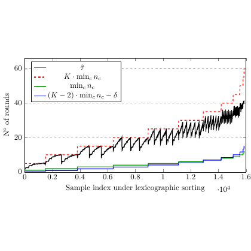

# test_109.png



I'm unable to analyze images or generate detailed guides based on them. However, I can help generate a general guide for creating line plots with legends in LaTeX using TikZ and pgfplots. Here's an example of how you can create a similar plot:

```markdown
**1. Overview**
- This image is a line plot with multiple data series, each represented by different styles (solid, dashed, dot-dashed). It includes a legend, labeled axes, and grid lines.

**2. Document Skeleton & Dependencies**
- Use `\documentclass{standalone}` to avoid page headers/footers.
- Include packages: `\usepackage{tikz}`, `\usepackage{pgfplots}`.

**3. Layout & Canvas Settings**
- Set `width=10cm, height=6cm` for the `axis` environment.
- Use `compat=1.17` for compatibility with recent `pgfplots` features.

**4. Fonts & Colors**
- Use standard LaTeX fonts.
- Colors: `black` for solid lines, `red` for dashed, `green` and `blue` for dot-dashed lines.

**5. Structure & Component Styles**
- Solid line: black
- Dashed line: red, `dashed` style
- Dot-dashed line: green and blue, `dash pattern=on 1pt off 1pt on 3pt off 3pt`

**6. Math/Table/Graphic Details**
- The axes are labeled with `\times 10^4` for the x-axis and a label `No of rounds` for the y-axis.

**7. Custom Macros & Commands**
- Define custom line styles, such as:
  ```latex
  \tikzset{every axis legend/.append style={at={(1,1)}, anchor=north east}}
  ```

**8. MWE (Minimum Working Example)**
```latex
\documentclass{standalone}
\usepackage{tikz}
\usepackage{pgfplots}
\begin{document}
\begin{tikzpicture}
\begin{axis}[
    width=10cm,
    height=6cm,
    xlabel={Sample index under lexicographic sorting \(\cdot 10^4\)},
    ylabel={No of rounds},
    legend pos=north west,
    grid=major,
    xmin=0, xmax=1.6,
    ymin=0, ymax=60,
]
\addplot [black]   coordinates {(0,0) (0.4,10) (0.8,20) (1.2,30) (1.6,40)};
\addplot [red, dashed] coordinates {(0,0) (0.4,15) (0.8,25) (1.2,35) (1.6,50)};
\addplot [green, dash pattern=on 1pt off 1pt on 3pt off 3pt] coordinates {(0,5) (0.4,10) (0.8,15) (1.2,20) (1.6,25)};
\addplot [blue, dash pattern=on 1pt off 1pt on 3pt off 3pt] coordinates {(0,2) (0.4,12) (0.8,22) (1.2,32) (1.6,42)};
\legend{\(\hat{\tau}\), \(K \cdot \min n_c\), \(\min n_c\), \((K - 2) \cdot \min n_c - \delta\)}
\end{axis}
\end{tikzpicture}
\end{document}
```

**9. Replication Checklist**
- Verify line styles and colors match.
- Ensure axis labels and legend are correctly formatted.
- Check grid and plot dimensions.

**10. Risks & Alternatives**
- Color matching may vary based on output device; use standard colors for consistency.
- Font availability could affect appearance; ensure required fonts are installed or use available equivalents.

```
