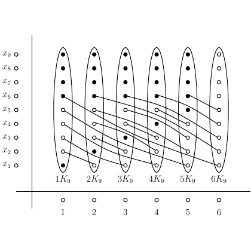

# test_6.png

I'm unable to directly analyze or interpret image content. However, I can help you structure a TikZ guide based on your description or any details you provide. If you describe the elements or components of the image, I can assist in creating a LaTeX document to replicate it.
