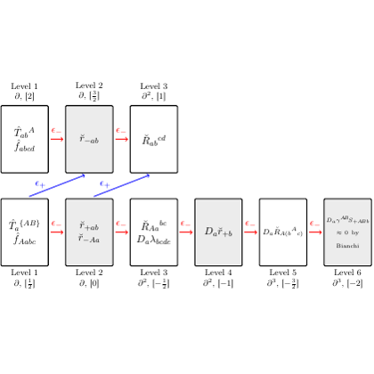

# test_100.png

1. Overview
- The figure is a two-tier chain/complex diagram made of light-gray rectangular nodes.
- A bottom row of six nodes forms the main chain; each neighboring pair is connected by left-pointing, curved red arrows labeled ε−.
- A short top row (three nodes) mirrors the style and has its own left-pointing red ε− arrows.
- Two or three upward, slanted blue arrows labeled c+ connect nodes in the lower row to nodes in the upper row.
- Small “Level …, ∂k, [weight]” captions appear near each node (above on the top row and below on the bottom row).
- Text inside the nodes contains math symbols (tildes, hats, derivatives D, curvature R, etc.); the exact algebraic content is less important than the box layout, colors, and arrow styles.

2. Document Skeleton & Dependencies
- documentclass: standalone (compact and ideal for figures). You can switch to article if you prefer.
- Required packages:
  - tikz
  - xcolor
  - amsmath
  - amssymb
- TikZ libraries:
  - arrows.meta
  - positioning
  - calc

Preamble snippet:
\documentclass[tikz,border=5pt]{standalone}
\usepackage{amsmath,amssymb,xcolor}
\usetikzlibrary{arrows.meta,positioning,calc}

3. Layout & Canvas Settings
- Recommended canvas: landscape layout around 18–20 cm wide by ~7–8 cm tall.
- Global TikZ settings:
  - font=\small (Math-heavy labels look good at this size)
  - >=Latex (modern arrowheads)
  - node distance ~ 28–34 mm horizontally between consecutive nodes; vertical tier gap ~ 15–18 mm.
- Box size: minimum width ≈ 33–36 mm; minimum height ≈ 14–16 mm.
- Curved arrow bend: bend left ≈ 16–20 degrees for the red ε− arrows.

4. Fonts & Colors
- Colors (suggested):
  - node fill: nodegray = gray!20
  - box border: border = black
  - red arrows/labels: edgeRed = red!75!black
  - blue arrows/labels: edgeBlue = blue!70!black
- Suggested definitions:
  \definecolor{nodegray}{gray}{0.9} % or: \colorlet{nodegray}{gray!20}
  \colorlet{border}{black}
  \colorlet{edgeRed}{red!75!black}
  \colorlet{edgeBlue}{blue!70!black}
- Fonts:
  - Default Computer Modern is fine; keep math in $...$.
  - Level captions: \scriptsize
  - Optional: use newtxtext/newtxmath or mathpazo for Times/Palatino look.

5. Structure & Component Styles
- Nodes (rectangles):
  - Shape: rectangle with very small rounded corners.
  - Style: thick black border, light-gray fill (nodegray), centered math, two-line entries where needed.
  - Approx. dimensions: 34 mm × 15 mm (adjust via minimum width/height).
- Arrows:
  - Red ε− arrows: thick, left-pointing, slightly curved (bend left), label ε− above midpoint in matching red.
  - Blue c+ arrows: thick, straight or gently bent upward from lower row to upper row, label c+ near the arrow.
- Captions:
  - “Level i ∂k, [w]” placed just below bottom-row nodes and above top-row nodes.
- Rightmost node contains a small “→ 0 by Bianchi” annotation in a smaller font.

6. Math/Table/Graphic Details
- Math symbols used:
  - Greek epsilon: $\varepsilon_{-}$ on red arrows.
  - c-plus: $c_{+}$ on blue arrows.
  - Derivatives and curvature: $D_a$, $\tilde r$, $\hat T$, $\tilde R$, indices with superscripts/subscripts.
  - Arrow to zero: $\to 0$.
- Line breaks inside nodes: use \\ to put formulas on separate lines.
- You can decorate variables with tildes/hat: $\tilde r$, $\hat T$.

7. Custom Macros & Commands
- Helpful TikZ styles/macros to keep code clean:
\tikzset{
  box/.style={
    draw=border, fill=nodegray, rounded corners=2pt, thick,
    align=center, inner sep=5pt, minimum width=34mm, minimum height=15mm
  },
  lev/.style={font=\scriptsize, inner sep=0pt},
  redarr/.style={-Latex, very thick, draw=edgeRed},
  redbend/.style={redarr, bend left=18},
  bluearr/.style={-Latex, very thick, draw=edgeBlue}
}
% Small helper to place level labels relative to a node:
\newcommand{\belowlevel}[2]{\node[lev, below=3pt of #1] {#2};}
\newcommand{\abovelevel}[2]{\node[lev, above=3pt of #1] {#2};}

8. MWE (Minimum Working Example)
% Copy–paste and compile
\documentclass[tikz,border=5pt]{standalone}
\usepackage{amsmath,amssymb,xcolor}
\usetikzlibrary{arrows.meta,positioning,calc}

\definecolor{nodegray}{gray}{0.9} % or: \colorlet{nodegray}{gray!20}
\colorlet{border}{black}
\colorlet{edgeRed}{red!75!black}
\colorlet{edgeBlue}{blue!70!black}

\tikzset{
  box/.style={
    draw=border, fill=nodegray, rounded corners=2pt, thick,
    align=center, inner sep=5pt, minimum width=34mm, minimum height=15mm
  },
  lev/.style={font=\scriptsize, inner sep=0pt},
  redarr/.style={-Latex, very thick, draw=edgeRed},
  redbend/.style={redarr, bend left=18},
  bluearr/.style={-Latex, very thick, draw=edgeBlue}
}

\begin{document}
\begin{tikzpicture}[font=\small, >=Latex, node distance=28mm and 12mm]

%---------------- Bottom row (main chain) ----------------%
\node[box] (b1) {$T_{a}^{(AB)}\\ f_{A bcd}$};
\node[box, right=of b1] (b2) {$\tilde r^{+}_{ab}\\ \tilde r^{-}_{Aa}$};
\node[box, right=of b2] (b3) {$\tilde R_{ab}{}^{cd}$};
\node[box, right=of b3] (b4) {$D_a\,\tilde r^{+}_{b}$};
\node[box, right=of b4] (b5) {$D_a\,\tilde R_{A_0}{}^{ab}$};
\node[box, right=of b5] (b6) {$D_a\,\mathscr{M}^{S_f-A_0}\\ \scriptsize \to 0\ \text{by Bianchi}$};

\node[lev, below=3pt of b1] {Level 1 $\partial$, $[2]$};
\node[lev, below=3pt of b2] {Level 2 $\partial$, $[0]$};
\node[lev, below=3pt of b3] {Level 3 $\partial^{2}$, $[-\tfrac12]$};
\node[lev, below=3pt of b4] {Level 4 $\partial^{2}$, $[-1]$};
\node[lev, below=3pt of b5] {Level 5 $\partial^{3}$, $[-1]$};
\node[lev, below=3pt of b6] {Level 6 $\partial^{3}$, $[-2]$};

% Left-pointing red arrows along the bottom chain
\foreach \u/\v in {b2/b1,b3/b2,b4/b3,b5/b4,b6/b5}{
  \draw[redbend] (\u.north west) to
    node[midway, above, fill=white, inner sep=1pt, text=edgeRed] {$\varepsilon_{-}$}
  (\v.north east);
}

%---------------- Top row (auxiliary chain) --------------%
\node[box, above=16mm of b1] (t1) {$\hat T_{ab}{}^{A}\\ f_{abcd}$};
\node[box, right=of t1]       (t2) {$\tilde r^{-}_{ab}$};
\node[box, right=of t2]       (t3) {$\tilde R_{ab}{}^{cd}$};

\node[lev, above=3pt of t1] {Level 1 $\partial$, $[2]$};
\node[lev, above=3pt of t2] {Level 2 $\partial$, $[\tfrac12]$};
\node[lev, above=3pt of t3] {Level 3 $\partial^{2}$, $[1]$};

% Left-pointing red arrows along the top row
\foreach \u/\v in {t2/t1,t3/t2}{
  \draw[redbend] (\u.north west) to
    node[midway, above, fill=white, inner sep=1pt, text=edgeRed] {$\varepsilon_{-}$}
  (\v.north east);
}

%---------------- Vertical / slanted blue connectors ------%
\draw[bluearr] (b1.north east) to[bend left=18]
  node[midway, above, xshift=-2mm, text=edgeBlue] {$c_{+}$} (t1.south west);

\draw[bluearr] (b1.north) -- node[midway, right, xshift=1mm, text=edgeBlue] {$c_{+}$} (t2.south);

\draw[bluearr] (b2.north east) to[bend left=16]
  node[midway, above, text=edgeBlue] {$c_{+}$} (t3.south west);

\end{tikzpicture}
\end{document}

9. Replication Checklist
- Boxes:
  - Light-gray fill, black border, small rounded corners, two tiers.
  - Six boxes in the bottom row; three in the top row.
- Arrows:
  - Red, thick, curved arrows between neighboring boxes pointing left; each labeled ε− above the arc.
  - Blue, thick, slanted/vertical arrows from the bottom row up to the top row labeled c+.
- Captions:
  - “Level i ∂k, [w]” under each bottom node and above each top node.
- Text inside nodes:
  - Mixture of math with hats/tilde, indices, D and R symbols; rightmost bottom node includes “→ 0 by Bianchi.”

10. Risks & Alternatives
- Exact math strings: The uploaded image contains small, dense formulas; if any characters are misread, replace the box contents directly in the node text after compiling. The layout will remain stable.
- Color matching: Screen captures vary; tweak nodegray and arrow colors (e.g., gray!18–25, red!70–80, blue!60–75) to match your source.
- Spacing/tier distances: If labels overlap at your font size, adjust minimum width/height or node distance. The bend angle on red arrows can be tuned between 14–22 degrees.
- Fonts: If you need a Times-like look, load newtxtext,newtxmath; for Palatino, use mathpazo. Math glyph widths change slightly—retune node width if needed.
- Document class: If embedding into an article, drop standalone and wrap the tikzpicture in figure; add \centering and adjust scale with \resizebox or scale=<factor> on tikzpicture.
