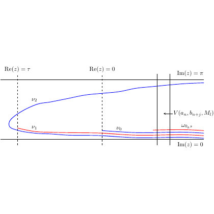

# test_104.png



1. Overview
- The image is a schematic of regions and contours in the complex plane.
- Two horizontal black lines represent the boundaries Im(z)=0 and Im(z)=π.
- Two dashed vertical lines mark Re(z)=τ (left) and Re(z)=0 (center).
- A narrow vertical strip near the right, delimited by two solid vertical lines, is annotated V(a_n, b_{n+j}, M_ℓ).
- Several smooth curves run across the strip:
  - A higher blue curve labeled ν₂, bending leftward and then heading right.
  - A family of low, almost horizontal curves near Im(z)=0: one blue and two red, with labels ν₁, ν₀ and ω_{0,s}.
- All labels are in math style.

2. Document Skeleton & Dependencies
- Recommended document class:
  - standalone (easy to compile a single figure) or article.
- Required packages:
  - tikz
  - xcolor
  - amsmath
  - amssymb
- TikZ libraries:
  - arrows.meta (modern arrow tips)
  - calc (coordinate arithmetic)

3. Layout & Canvas Settings
- Suggested canvas: width ≈ 11–12 cm; height ≈ 4–4.5 cm.
- In TikZ, use x=1cm, y=1cm, and a scale of 1.0 for predictable placement.
- Global styles: moderate line widths (0.8–1.0 pt), dashed for guide verticals, solid for boundaries, rounded caps for smooth curves.

4. Fonts & Colors
- Fonts:
  - Default Computer Modern is fine; use math mode for all labels.
  - Use \scriptsize for labels to keep text unobtrusive.
- Colors (suggested):
  - curveblue: RGB(30, 80, 200)  → a deep blue for ν₂ and one low curve.
  - curvered:  RGB(200, 40, 40)  → a vivid red for the two low curves.
  - axis:      black!80          → guide lines/axes text.
  - These produce strong contrast while remaining subdued.

5. Structure & Component Styles
- Horizontal boundary lines:
  - Two solid black lines across the full width at y=0 and y≈3.2 (Im(z)=0 and Im(z)=π). Line width ≈ 0.8 pt.
- Vertical markers:
  - Dashed verticals at Re(z)=τ and Re(z)=0. Line width ≈ 0.8 pt, dashed.
  - Two solid verticals close together near the right (form a narrow strip).
- Curves:
  - Upper blue ν₂: smooth, slightly undulating path rising from left and ending near y close to Im(z)=π on the right.
  - Lower family: one blue and two red smooth, slightly wavy, almost horizontal paths near the bottom boundary.
- Labels:
  - Re(z)=τ, Re(z)=0 above the corresponding dashed verticals.
  - Im(z)=0 and Im(z)=π at the right ends of the horizontal lines.
  - ν₂, ν₁, ν₀ placed near the corresponding curves.
  - ω_{0,s} near the lower blue curve (with a short leader arrow).
  - V(a_n, b_{n+j}, M_ℓ) with an arrow pointing to the narrow vertical strip.

6. Math/Table/Graphic Details
- Use \operatorname{Re}(z) and \operatorname{Im}(z) for upright “Re” and “Im”.
- Greek letters: \tau, \pi, \nu_0, \nu_1, \nu_2, and \omega_{0,s}.
- Subscripts and multi-letter indices: a_n, b_{n+j}, M_\ell (ell).
- The region label V(a_n, b_{n+j}, M_\ell) is plain math text.

7. Custom Macros & Commands
- Define reusable TikZ styles for clarity:
  - axis, vdash for dashed verticals, vsolid for the region borders.
  - curveB and curveR for blue/red curves.
  - mathlabel for uniformly small math labels.
- Optional constants for key x-positions (τ, 0, and the right strip) and the top y.

8. MWE (Minimum Working Example)
- Copy-paste and compile.

```latex
\documentclass[tikz,border=6pt]{standalone}
\usepackage{amsmath,amssymb}
\usepackage{xcolor}
\usetikzlibrary{arrows.meta,calc}

% Colors
\definecolor{curveblue}{RGB}{30,80,200}
\definecolor{curvered}{RGB}{200,40,40}
\colorlet{axis}{black!80}

% Styles
\tikzset{
  axisline/.style={axis, line width=0.8pt},
  vdash/.style={black!75, dashed, line width=0.8pt},
  vsolid/.style={black, line width=0.9pt},
  curveB/.style={draw=curveblue, line width=1.0pt, line cap=round},
  curveR/.style={draw=curvered,  line width=0.9pt, line cap=round},
  mathlabel/.style={font=\scriptsize, text=black},
  >={Stealth[length=2.4mm,width=2mm]}
}

\begin{document}
\begin{tikzpicture}[x=1cm,y=1cm]

% --- Key coordinates (tune to taste) ---
\def\yTop{3.2}
\def\xLeft{-0.4}
\def\xRight{10.2}
\def\xTau{1.6}
\def\xZero{4.6}
\def\xA{8.0}   % left border of right strip
\def\xB{8.7}   % right border of right strip

% --- Horizontal boundaries Im(z)=0 and Im(z)=pi ---
\draw[axisline] (\xLeft,0) -- (\xRight,0);
\draw[axisline] (\xLeft,\yTop) -- (\xRight,\yTop);

% Labels for Im(z)
\node[mathlabel, anchor=west] at (\xRight,0) {$\operatorname{Im}(z)=0$};
\node[mathlabel, anchor=west] at (\xRight,\yTop) {$\operatorname{Im}(z)=\pi$};

% --- Dashed verticals Re(z)=tau and Re(z)=0 ---
\draw[vdash] (\xTau,0) -- (\xTau,\yTop);
\draw[vdash] (\xZero,0) -- (\xZero,\yTop);

\node[mathlabel, anchor=south] at (\xTau,\yTop+0.15) {$\operatorname{Re}(z)=\tau$};
\node[mathlabel, anchor=south] at (\xZero,\yTop+0.15) {$\operatorname{Re}(z)=0$};

% --- Right-hand vertical strip ---
\draw[vsolid] (\xA,0) -- (\xA,\yTop);
\draw[vsolid] (\xB,0) -- (\xB,\yTop);

% Label for the strip
\node[mathlabel, anchor=west] (Vlab) at (6.0,1.8) {$V(a_n,b_{n+j},M_\ell)$};
\draw[-{Stealth}] (Vlab.east) .. controls +(1.2,0.1) and +(-0.8,-0.1) .. ({(\xA+\xB)/2},1.55);

% --- Curves ---
% Upper blue curve (nu_2)
\draw[curveB]
  (0.35,0.25)
  .. controls (-0.15,0.05) and (0.00,0.90) .. (0.95,1.05)
  .. controls (2.20,1.30) and (3.80,1.55) .. (4.70,1.70)
  .. controls (6.25,1.95) and (7.30,2.55) .. (8.65,2.85);

% Low family: blue + red + red
\draw[curveB] (0.20,0.48)
  .. controls (2.50,0.45) and (5.00,0.48) .. (8.70,0.55);
\draw[curveR] (0.22,0.35)
  .. controls (2.00,0.32) and (5.20,0.35) .. (8.70,0.43);
\draw[curveR] (0.25,0.27)
  .. controls (2.20,0.25) and (5.40,0.28) .. (8.75,0.36);

% --- Curve labels ---
\node[mathlabel] at (0.60,1.35) {$\nu_2$};
\node[mathlabel] at (0.55,0.18) {$\nu_1$};
\node[mathlabel] at (4.65,0.62) {$\nu_0$};

% omega_{0,s} label with a short arrow to the blue low curve
\node[mathlabel, anchor=west] (wlab) at (8.05,0.95) {$\omega_{0,s}$};
\draw[-{Stealth}] ($(wlab.west)+(-0.05,0)$) -- ++(-0.70,-0.34);

\end{tikzpicture}
\end{document}
```

9. Replication Checklist
- Two solid horizontal lines across the canvas at y=0 and y≈π, labeled at the right ends.
- Two dashed verticals labeled Re(z)=τ (left) and Re(z)=0 (center).
- Two solid verticals forming a narrow strip near the right; arrow-labeled as V(a_n, b_{n+j}, M_ℓ).
- One blue upper curve (ν₂) with a leftward bend then rising toward the right.
- Three low, nearly horizontal curves near Im(z)=0: blue centered between two red ones.
- Labels ν₂ (upper), ν₁ (lower left red), ν₀ (near low family mid-right), and ω_{0,s} with a small arrow to the low blue curve.
- Line weights: axes ~0.8–0.9 pt; curves slightly heavier (≈1.0 pt). Dashed style for vertical guides.

10. Risks & Alternatives
- Exact color matching: monitor/renderer differences may alter hues. Adjust RGB values for curveblue/curvered as needed.
- Font differences: Computer Modern (default) may differ from your document’s fonts. If you use Times-like fonts, consider \usepackage{newtxtext,newtxmath} to harmonize.
- Curve shapes: The original smoothness is approximate; tweak Bezier control points for tighter resemblance.
- Spacing of the right strip: If your page size changes, the strip could appear too close to the edge; adjust \xA and \xB or the overall width (\xRight).
- Arrow clash: On very small scales the arrows may overlap curves; adjust anchor positions or arrow control points.
- Alternative implementation: If you prefer parameterized smooth plots, you can replace the Bezier paths with \draw[plot,smooth] coordinates to fine-tune the waviness uniformly.
