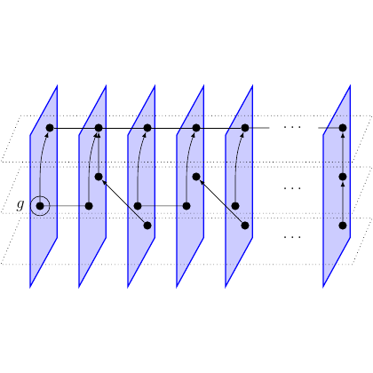

# test_106.png



1. Overview
- The image shows a sequence of translucent, slanted “slices” (parallelogram panels) arranged from left to right. Each slice contains a few black nodes (dots). Directed links connect nodes both within the same slice (short vertical/curved moves) and across consecutive slices (diagonal or horizontal arrows).
- Three dotted horizontal guide levels run across the entire figure (top, middle, bottom). A small bullseye symbol labeled g appears at the left of the middle level and an arrow leaves it toward the first slice.
- Ellipses (...) at the far right suggest continuation of the pattern.

2. Document Skeleton & Dependencies
- \documentclass: standalone (compact, good for TikZ figures)
- Required packages and libraries:
  - tikz
  - xcolor
  - amsmath, amssymb (for g in math and the bullseye symbol)
  - TikZ libraries: arrows.meta, calc

3. Layout & Canvas Settings
- Recommended canvas: roughly 11 cm wide by 4.5 cm tall (the standalone class scales to content). In TikZ, use scale=1 with a border of 6–8 pt.
- Global TikZ settings:
  - line cap=round, line join=round for smooth corners
  - Arrowhead: Stealth from arrows.meta
  - A small opacity for panel fills so edges and dots remain visible through panels

4. Fonts & Colors
- Fonts:
  - Default LaTeX (Latin Modern). Mathematical label g set in math italics: $g$.
  - Ellipsis as $\cdots$ for consistent spacing.
- Color palette (suggestions; tweak to taste):
  - Plane edge: planeEdge = blue!70!black
  - Plane fill (translucent): planeFill = blue!20 (used with fill opacity ≈ 0.3–0.4)
  - Dotted guide levels: guideGray = black!55
  - Dots and text: black
  Suggested definitions:
  - \colorlet{planeEdge}{blue!70!black}
  - \colorlet{planeFill}{blue!20}
  - \colorlet{guideGray}{black!55}

5. Structure & Component Styles
- Dotted guide levels:
  - Three straight dotted lines at y ≈ 1.35, 0, −1.35 across the full width.
  - Style: draw=guideGray, dotted, line width=0.5–0.6 pt.
- Slices (panels):
  - Slanted parallelograms; height ≈ 3.4–3.6 units, narrow width (≈ 0.4–0.5 units), slant to the right.
  - Style: draw=planeEdge, line width≈0.8 pt; fill=planeFill with fill opacity≈0.35.
- Dots (nodes):
  - Small solid black circles; radius ≈ 1.5–1.7 pt.
  - Positioned near the center of each slice on the three guide levels (some slices can omit a level if desired).
- Links:
  - Directed arrows: -Stealth, line width≈0.7 pt.
  - Short curved arrow within a slice (middle→top); several diagonal/horizontal inter-slice arrows.
- Left label:
  - Bullseye symbol at the middle guide level, labeled g on its left; an arrow from it to the first slice’s middle node.
- Continuation marks:
  - $\cdots$ on each guide level at the right side.

6. Math/Table/Graphic Details
- Symbols:
  - Bullseye: $\odot$
  - Ellipsis: $\cdots$
  - Label: $g$ in math mode
- TikZ specifics:
  - Use arrows.meta for Stealth arrowheads
  - Use fill opacity to achieve translucent panels
  - Curved arrow within a slice can be drawn with to[out=...,in=...]

7. Custom Macros & Commands
- Reusable styles:
  - plane: the slanted translucent panel
  - guide: dotted guide levels
  - dot: small black node
  - link: directed connection
- Helper macro for a single slice at x-position X:
  - \slice{X} draws one slanted panel around x=X.
- Coordinates for repeated levels:
  - Define top/middle/bottom y-values once and reuse.

8. MWE (Minimum Working Example)
- Copy, paste, and compile as-is.

```latex
\documentclass[tikz,border=7pt]{standalone}

\usepackage{amsmath,amssymb}
\usepackage{xcolor}
\usetikzlibrary{arrows.meta,calc}

% Colors
\colorlet{planeEdge}{blue!70!black}
\colorlet{planeFill}{blue!20}
\colorlet{guideGray}{black!55}

% TikZ styles
\tikzset{
  >=Stealth,
  plane/.style={draw=planeEdge, line width=0.8pt, fill=planeFill, fill opacity=0.35},
  guide/.style={draw=guideGray, dotted, line width=0.6pt},
  dot/.style={circle, fill=black, inner sep=1.6pt},
  link/.style={-Stealth, line width=0.7pt},
}

% Level positions
\def\yt{1.35}
\def\ym{0}
\def\yb{-1.35}

% A slanted "slice" centered near x = #1
\newcommand{\slice}[1]{%
  % narrow slanted parallelogram
  \path[plane]
    (#1-0.38,-1.7) -- (#1-0.08,-1.7) -- (#1+0.38,1.7) -- (#1+0.08,1.7) -- cycle;
}

\begin{document}
\begin{tikzpicture}[line cap=round,line join=round,scale=1]

% --------- guide levels ----------
\draw[guide] (-1.4,\yt) -- (10.2,\yt);
\draw[guide] (-1.4,\ym) -- (10.2,\ym);
\draw[guide] (-1.4,\yb) -- (10.2,\yb);

% x-positions of slices (tuned by eye)
\def\xA{0.00}
\def\xB{1.55}
\def\xC{3.10}
\def\xD{4.65}
\def\xE{6.20}
\def\xF{7.75}
\def\xG{9.30} % far-right extra slice

% --------- draw slices and dots ----------
\foreach \x in {\xA,\xB,\xC,\xD,\xE,\xF}{
  \slice{\x}
  % three dots (top/mid/bottom) inside each slice
  \fill (\x+0.10,\yt) circle (1.6pt);
  \fill (\x+0.08,\ym) circle (1.6pt);
  \fill (\x+0.06,\yb) circle (1.6pt);
}

% An extra slice at the far right (to emphasize continuation)
\slice{\xG}
\fill (\xG+0.10,\yt) circle (1.6pt);
\fill (\xG+0.08,\ym) circle (1.6pt);
\fill (\xG+0.06,\yb) circle (1.6pt);

% Named coordinates for links
\foreach \n/\x in {A/\xA,B/\xB,C/\xC,D/\xD,E/\xE,F/\xF}{
  \coordinate (\n T) at (\x+0.10,\yt);
  \coordinate (\n M) at (\x+0.08,\ym);
  \coordinate (\n B) at (\x+0.06,\yb);
}

% --------- links (sample pattern) ----------
% in-slice moves
\draw[link] (A M) to[out=80,in=250] (A T);
\draw[link] (C T) -- (C M);
\draw[link] (D M) -- (D B);

% inter-slice moves
\draw[link] (A T) -- (B T);
\draw[link] (B M) -- (C B);
\draw[link] (C T) -- (D M);
\draw[link] (D B) -- (E M);
\draw[link] (E M) -- (F T);

% left source and label g
\node (seed) at (-1.0,0) {$\odot$};
\node[left] at (seed.west) {$g$};
\draw[link] (seed.east) -- (A M);

% right-side ellipses
\node at (9.85,\yt) {$\cdots$};
\node at (9.85,\ym) {$\cdots$};
\node at (9.85,\yb) {$\cdots$};

\end{tikzpicture}
\end{document}
```

9. Replication Checklist
- Dotted guide levels: three evenly spaced lines across the figure.
- Slanted translucent blue slices: 6–7 instances, same slant and height.
- Small black dots on the three levels within each slice.
- A short curved arrow inside the first slice (middle to top).
- Several diagonal/horizontal inter-slice arrows connecting adjacent slices.
- A bullseye symbol at the far left on the middle level, labeled g, with an outgoing arrow to the first slice.
- Ellipses (...) at the right on all three levels to indicate continuation.
- Overall proportions: wide horizontal layout, modest vertical height, translucent panels do not overpower the dots/links.

10. Risks & Alternatives
- Exact color/opacity: Different PDF viewers/printers may display transparency slightly differently. Adjust planeFill or fill opacity if the panels appear too strong or too faint.
- Slant and proportions: The slant is tuned by eye; if your panels look too narrow/wide, tweak the four x-offsets in \slice.
- Arrow placement: If arrowheads overlap dots, adjust coordinates slightly or add shorten >=1pt, shorten <=1pt to link.
- Fonts: If your document uses a different main font, the visual weight of dots/labels may change. Adjust inner sep for dot style and line widths accordingly.
- Perspective alternatives: For a stronger “3D sheet” effect for the guide levels, draw thin dotted parallelogram strips instead of single dotted lines (two parallel dotted lines with slight vertical separation), or use a scope with a small xslant to the entire picture.
- Reusability: If you need many slices with varying dot patterns, create a macro that accepts a list of which levels to populate and where to draw in-slice arrows.
