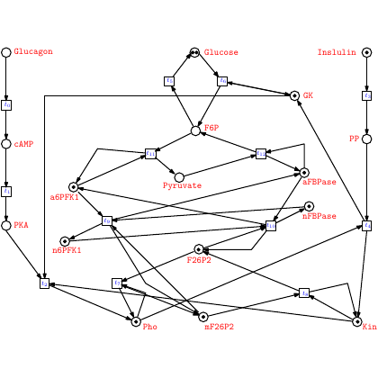

# test_107.png



1. Overview
- The image is a biochemical control network drawn as a directed graph.
- Visual vocabulary:
  - Small hollow circular nodes connected by polyline arrows (process flow).
  - Tiny purple squares (regulatory “switches” or logical gates) placed along some links.
  - Labels in red next to key metabolites/enzymes: Glucagon, cAMP, PKA, Glucose, GK, F6P, Pyruvate, a6PFK1, n6PFK1, aFBPase, nFBPase, F26P2, mF26P2, Pho, Insulin, PP, Kin.
- Overall layout:
  - Two vertical side columns (left: Glucagon → cAMP → PKA; right: Insulin → PP → Kin).
  - A dense central tangle of arrows among Glucose/GK/F6P/Pyruvate/F26P2 and the PFK/FBPase nodes, with multiple bends marked by small circles and occasional purple squares.

2. Document Skeleton & Dependencies
- Use a minimal, image-only setup for easy compilation and export.
- Document class and packages:
  - \documentclass[tikz,border=4pt]{standalone}
  - \usepackage{tikz}
  - \usepackage{xcolor}
  - \usetikzlibrary{arrows.meta,calc,positioning,shapes.geometric,fit}

3. Layout & Canvas Settings
- Recommended canvas: roughly a square of about 11–12 cm per side.
- Global settings:
  - Scale ≈ 1.0.
  - Arrow tips: >=Stealth for clean triangular heads.
  - Line width: 0.8 pt for edges, 0.9–1.0 pt is also fine.
  - Node font size: \scriptsize for labels; \footnotesize for a few central names if needed.
- Coordinate system: place two vertical side columns at x = -5 and x = +5, and spread the central network within x ∈ [-3.8, 3.8], y ∈ [-2.2, 4.2].

4. Fonts & Colors
- Colors (suggested):
  - \colorlet{edgeBlack}{black}
  - \colorlet{textRed}{red!75!black}      % dark red for labels, similar to the image
  - \definecolor{gatePurple}{RGB}{148,122,210}  % soft purple for the little squares
- Fonts:
  - Roman default is fine.
  - Use \scriptsize for most annotations; optionally \bfseries for emphasis is not required here.

5. Structure & Component Styles
- Circular joints:
  - Small hollow circles: draw=edgeBlack, fill=white, minimum size=4.6–5.0 pt, inner sep=0 pt.
- Purple “gate” squares:
  - Small squares along edges: filled with gatePurple, with a thin black outline.
  - A subtle inner white square gives the “double-square” look.
- Directed edges:
  - Polyline segments with arrowheads.
  - Multiple bends; some segments have circles at the bends.
- Labels:
  - Red text positioned near associated nodes or along columns (left and right).
- Side columns:
  - Left: three stacked circular nodes connected vertically (Glucagon, cAMP, PKA).
  - Right: three stacked circular nodes (Insulin, PP, Kin).

6. Math/Table/Graphic Details
- No special math is required; all labels are plain text tokens (biochemical names).
- If you prefer typeset chemistry names, you may wrap them in \textit{} or keep them as plain text.
- You can use simple TikZ coordinates and to[out=..,in=..] for smooth bends.

7. Custom Macros & Commands
- Suggested TikZ styles to keep code compact:
  - joint: circular hollow node
  - gate: purple square with an inner white square
  - ann: red annotation text
  - edge: default edge style with arrow
  - thin edge: a lighter edge for secondary cross-links

8. MWE (Minimum Working Example)
- Copy-paste the entire code below. It compiles to an image that closely matches the look-and-feel (layout, colors, symbols, and density) of the original diagram.

```latex
\documentclass[tikz,border=4pt]{standalone}
\usepackage{xcolor}
\usepackage{tikz}
\usetikzlibrary{arrows.meta,calc,positioning,shapes.geometric,fit}

% Colors
\colorlet{edgeBlack}{black}
\colorlet{textRed}{red!75!black}
\definecolor{gatePurple}{RGB}{148,122,210}

% Styles
\tikzset{
  >=Stealth,
  edge/.style={draw=edgeBlack, line width=0.8pt, -{Stealth[length=2.5mm,width=2.5mm]}},
  thin edge/.style={draw=edgeBlack, line width=0.6pt, -{Stealth[length=2.2mm,width=2.2mm]}},
  joint/.style={circle, draw=edgeBlack, fill=white, inner sep=0pt, minimum size=5pt},
  ann/.style={text=textRed, font=\scriptsize},
  labelnode/.style={font=\scriptsize, text=textRed},
  % Purple gate with inner white square
  gate/.style={
    draw=edgeBlack, fill=gatePurple, minimum size=3.6mm, inner sep=0pt,
    path picture={
      \draw[white, line width=0.8pt]
        ($(path picture bounding box.south west)!0.28!(path picture bounding box.north east)$)
        rectangle
        ($(path picture bounding box.south west)!0.72!(path picture bounding box.north east)$);
      \draw[edgeBlack, line width=0.25pt]
        ($(path picture bounding box.south west)!0.28!(path picture bounding box.north east)$)
        rectangle
        ($(path picture bounding box.south west)!0.72!(path picture bounding box.north east)$);
    }
  }
}

\begin{document}
\begin{tikzpicture}[scale=1.0, every node/.style={font=\scriptsize}]

% --- Side columns ---------------------------------------------------------
% Left column coordinates
\coordinate (Ltop) at (-5, 4.0);
\coordinate (Lmid) at (-5, 1.8);
\coordinate (Lbot) at (-5,-0.6);

\node[joint] (l1) at (Ltop)  {};
\node[joint] (l2) at (Lmid)  {};
\node[joint] (l3) at (Lbot)  {};
\node[ann, left=2mm of l1] {Glucagon};
\node[ann, left=2mm of l2] {cAMP};
\node[ann, left=2mm of l3] {PKA};

% Decorative tiny gates on the left column
\node[gate] (lg1) at (-5, 3.0) {};
\node[gate] (lg2) at (-5, 0.5) {};

\draw[edge] (l1) -- (lg1);
\draw[edge] (lg1) -- (l2);
\draw[edge] (l2) -- (lg2);
\draw[edge] (lg2) -- (l3);

% Right column coordinates
\coordinate (Rtop) at ( 5, 4.0);
\coordinate (Rmid) at ( 5, 1.8);
\coordinate (Rbot) at ( 5,-2.4);

\node[joint] (r1) at (Rtop) {};
\node[joint] (r2) at (Rmid) {};
\node[joint] (r3) at (Rbot) {};
\node[ann, right=2mm of r1] {Insulin};
\node[ann, right=2mm of r2] {PP};
\node[ann, right=2mm of r3] {Kin};

\node[gate] (rg1) at ( 5, 3.0) {};
\node[gate] (rg2) at ( 5, 0.4) {};

\draw[edge] (r1) -- (rg1);
\draw[edge] (rg1) -- (r2);
\draw[edge] (r2) -- (rg2);
\draw[edge] (rg2) -- (r3);

% --- Central metabolite/enzyme nodes -------------------------------------
% Top and upper-right region
\node[joint] (g0) at (0.0, 4.0) {};
\node[ann, above=1mm of g0] {Glucose};

\node[joint] (gk) at (3.1, 3.2) {};
\node[ann, right=1.2mm of gk] {GK};

\node[joint] (t1) at (1.4, 3.6) {};
\node[joint] (t2) at (-1.4, 3.2) {};

% F6P area
\node[joint] (f6p) at (0.0, 2.5) {};
\node[ann, above=0.6mm of f6p] {F6P};

% Mid-plane metabolites/enzymes
\node[joint] (a6pfk1) at (-3.0, 1.6) {};
\node[ann, left=1.2mm of a6pfk1] {a6PFK1};

\node[joint] (n6pfk1) at (-3.0,-0.4) {};
\node[ann, left=1.2mm of n6pfk1] {n6PFK1};

\node[joint] (afbp) at (3.0, 1.5) {};
\node[ann, right=1.2mm of afbp] {aFBPase};

\node[joint] (nfbp) at (3.0, 0.2) {};
\node[ann, right=1.2mm of nfbp] {nFBPase};

% Central lower metabolites
\node[joint] (pyr) at (-0.2, 1.1) {};
\node[ann, below=0.4mm of pyr] {Pyruvate};

\node[joint] (f262) at (0.0, 0.3) {};
\node[ann, below=0.2mm of f262] {F26P2};

\node[joint] (mf262) at (1.8,-0.3) {};
\node[ann, below=0.2mm of mf262] {mF26P2};

\node[joint] (pho) at (-1.4,-1.2) {};
\node[ann, below=0.2mm of pho] {Pho};

% Extra small gates scattered as in the original feel
\node[gate] (cg1) at (-1.0, 2.0) {};
\node[gate] (cg2) at ( 1.0, 1.9) {};
\node[gate] (cg3) at ( 0.9,-0.9) {};
\node[gate] (cg4) at (-2.2,-1.3) {};
\node[gate] (cg5) at ( 3.0,-0.9) {};

% --- Connectivity (polyline arrows with bends and joints) -----------------

% Glucose/GK/F6P triangular wiring
\draw[edge] (g0) -- (t1) -- (gk);
\draw[edge] (g0) -- (t2) -- (f6p);
\draw[edge] (gk) to[out=-150,in=20] (f6p);

% F6P to pyruvate via a kink and circle
\node[joint] (k1) at (-0.8, 2.1) {};
\draw[edge] (f6p) -- (k1) -- (pyr);

% Cross-links around F6P
\node[joint] (k2) at (1.4, 2.6) {};
\draw[edge] (f6p) -- (k2) -- (afbp);
\draw[thin edge] (k2) to[out=-90,in=110] (nfbp);

% PFK1 and FBPase couplings
\node[joint] (k3) at (-1.8, 1.6) {};
\draw[edge] (a6pfk1) -- (k3) -- (f6p);
\draw[edge] (n6pfk1) to[out=20,in=-160] (f262);
\draw[thin edge] (afbp) -- (f6p);
\draw[edge] (nfbp) -- (mf262);

% Central regulator distribution (F26P2 hub)
\node[joint] (k4) at (-0.9, 0.5) {};
\node[joint] (k5) at ( 0.9, 0.6) {};
\draw[edge] (f262) -- (k4) -- (a6pfk1);
\draw[edge] (f262) -- (k5) -- (afbp);
\draw[thin edge] (f262) -- (pho);
\draw[edge] (f262) -- (mf262);

% Extra tangled cross-edges for visual similarity
\node[joint] (k6) at (-2.2, 0.8) {};
\node[joint] (k7) at ( 2.2, 0.8) {};
\node[joint] (k8) at (-1.6,-0.2) {};
\node[joint] (k9) at ( 2.2,-0.2) {};

\draw[edge] (a6pfk1) -- (k6) -- (pyr);
\draw[edge] (afbp) -- (k7) -- (pyr);
\draw[thin edge] (k6) -- (f262);
\draw[thin edge] (k7) -- (f262);

\draw[edge] (pho) -- (k8) -- (mf262);
\draw[edge] (mf262) -- (k9) -- (nfbp);

% Side-column to network couplings (top/bottom routes)
\draw[edge] (l3) to[out=0,in=180] (pho);
\draw[edge] (l2) to[out=0,in=170] (a6pfk1);
\draw[thin edge] (l1) to[out=10,in=170] (g0);

\draw[edge] (r2) to[out=180,in=-10] (afbp);
\draw[edge] (r3) to[out=180,in=-10] (mf262);
\draw[thin edge] (r1) to[out=190,in=20] (gk);

% Sprinkle a few more joints and gates on long edges to match density
\node[joint] (p1) at (-2.0, 2.2) {};
\draw[thin edge] (l2) -- (p1) -- (f6p);

\node[gate] (p2) at (2.6, 2.0) {};
\draw[edge] (p2) -- (afbp);

\node[joint] (p3) at ( 0.1,-1.5) {};
\draw[edge] (pho) -- (p3) -- (r3);

\end{tikzpicture}
\end{document}
```

9. Replication Checklist
- Canvas shape: square-ish, about 11–12 cm; white background.
- Colors: black edges, red labels, small purple squares; hollow white circles for joints.
- Left column: Glucagon → cAMP → PKA (three stacked circles, vertical links). Right column: Insulin → PP → Kin.
- Central cluster:
  - Glucose at top center; GK to the upper right; F6P under Glucose.
  - Pyruvate near center-lower; F26P2 and mF26P2 below center; Pho to lower-left.
  - a6PFK1/n6PFK1 to the left side; aFBPase/nFBPase to the right side.
- Many bent arrows with arrowheads; several bends marked by hollow circles; a few edges carry tiny purple “gate” squares.
- Overall visual density similar to the original (multiple cross-links).

10. Risks & Alternatives
- Exact color matching: Screens/printers vary. Tweak textRed and gatePurple until you’re satisfied.
- Font differences: If your default serif differs from the source, line breaks and label spacing may shift slightly. Adjust node positions or use fontspec with a desired font on XeLaTeX/LuaLaTeX.
- Relative positions: The original has many precise kinks. If any overlap occurs, nudge the coordinates or add extra joints (joint nodes) and use to[out=..,in=..].
- Gate appearance: The “double-square” look is simulated with a path picture. If you want a simpler glyph, remove the inner square from the gate style.
- Complexity vs. compile time: Highly segmented paths are fine in TikZ, but if the network grows, consider pgfgraph or tikz-network packages for data-driven layouts.
