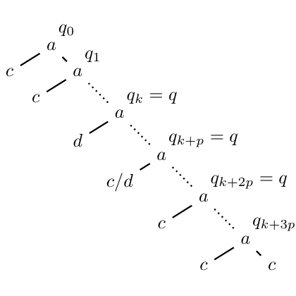

# test_3.png



1. Overview
- The image shows a diagonal “timeline” of states q0, q1, qk, qk+p, qk+2p, qk+3p positioned along a dotted main diagonal from the upper-left toward the lower-right.
- Short, thick, slanted strokes lie near this diagonal; most are labeled a, with a few labeled c, d, or c/d. These strokes repeat to suggest a periodic pattern.
- Key states are labeled on the diagonal: qk = q, qk+p = q, qk+2p = q, and the sequence continues to qk+3p.

2. Document Skeleton & Dependencies
- \documentclass: standalone (convenient for compiling a single TikZ figure)
- Required packages:
  - tikz
  - amsmath
  - amssymb
  - xcolor
- TikZ libraries:
  - calc (for simple coordinate arithmetic)

3. Layout & Canvas Settings
- Recommended canvas: roughly a square spanning about 10×10 cm.
- Use a single tikzpicture scaled around 0.9–1.0, with round line caps/joins for the short strokes.
- Global suggestions:
  - Line cap and join: round
  - Main diagonal: densely dotted, slightly thicker than default
  - Short slanted strokes: solid, thicker than the dotted diagonal
- Coordinate model: place the diagonal from (about) (0.8,−0.8) to (9.3,−9.3) and add strokes and labels using small offsets.

4. Fonts & Colors
- Colors:
  - Everything appears black. Define a single color alias for convenience:
    - \colorlet{ink}{black}
- Fonts:
  - Labels are standard LaTeX math italics (Computer Modern):
    - State labels: math mode, e.g., $q_0$, $q_k=q$, $q_{k+p}=q$.
    - Transition labels: math italics for a, c, d, and c/d (e.g., $a$, $c$, $d$, $c/d$).
  - Use default font size or slightly larger if needed for clarity.

5. Structure & Component Styles
- Main diagonal:
  - A straight line with densely dotted pattern, line width around 1.0–1.2 pt.
  - Orientation: slope −1 (from upper-left to lower-right).
- Short slanted strokes (repeated):
  - Solid, thicker (≈1.3–1.5 pt), length short (≈1.0–1.4 cm).
  - All share a similar slant (down to the right).
  - Labels near them: “a” most frequently; interspersed “c”, “d”, and one “c/d”.
- Key state labels:
  - Text placed on or slightly off the dotted diagonal near specific positions:
    - q0 and q1 early on the line.
    - qk = q, qk+p = q, qk+2p = q, qk+3p later along the diagonal.

6. Math/Table/Graphic Details
- Mathematical symbols:
  - Subscripts and arithmetic in subscripts: $q_0$, $q_1$, $q_k=q$, $q_{k+p}=q$, $q_{k+2p}=q$, $q_{k+3p}$.
  - Transition labels as math letters: $a$, $c$, $d$, and $c/d$.
- No special arrows or shapes beyond line segments and text.

7. Custom Macros & Commands
- Define styles to keep code compact:
  - mainline for the dotted diagonal
  - bar for short slanted strokes
  - longbar for the longer central stroke
  - lab and qtext for consistent label spacing
- If you want to generalize placements further, you could wrap a “stroke + label” into a small macro, but the MWE keeps them explicit for clarity.

8. MWE (Minimum Working Example)
Copy, paste, and compile with pdflatex.

```latex
\documentclass[tikz,border=4pt]{standalone}
\usepackage{amsmath,amssymb}
\usepackage{xcolor}
\usetikzlibrary{calc}

\colorlet{ink}{black}

\tikzset{
  mainline/.style={densely dotted, line width=1.1pt, color=ink},
  bar/.style={line width=1.4pt, color=ink, line cap=round},
  longbar/.style={line width=1.4pt, color=ink, line cap=round},
  qtext/.style={inner sep=1.2pt, color=ink},
  lab/.style={inner sep=1.2pt, color=ink}
}

\begin{document}
\begin{tikzpicture}[scale=0.95, line join=round, line cap=round]

  % Main diagonal (upper-left to lower-right)
  \draw[mainline] (0.8,-0.8) -- (9.3,-9.3);

  % State labels on/near the diagonal
  \node[qtext, anchor=south west] at (0.5,-0.2) {$q_0$};
  \node[qtext, anchor=south west] at (1.7,-1.2) {$q_1$};
  \node[qtext, anchor=west]       at (4.6,-4.6) {$q_k = q$};
  \node[qtext, anchor=west]       at (6.2,-6.2) {$q_{k+p} = q$};
  \node[qtext, anchor=west]       at (7.6,-7.6) {$q_{k+2p} = q$};
  \node[qtext, anchor=west]       at (8.9,-8.9) {$q_{k+3p}$};

  % Short slanted strokes and their labels
  % Top-left cluster
  \draw[bar] ($(0.9,-0.9)+(0.05,0.35)$) -- ++(0.95,-0.48);
  \node[lab, anchor=south] at ($(0.9,-0.9)+(0.55,0.10)$) {$a$};
  \node[lab, anchor=east]  at ($(0.9,-0.9)-(0.35,0.15)$) {$c$};

  \draw[bar] ($(1.7,-1.7)+(0.00,0.35)$) -- ++(0.95,-0.48);
  \node[lab, anchor=south] at ($(1.7,-1.7)+(0.55,0.10)$) {$a$};
  \node[lab, anchor=east]  at ($(1.7,-1.7)-(0.35,0.15)$) {$c$};

  % Mid-left strokes
  \draw[bar] ($(3.2,-3.2)+(0.00,0.35)$) -- ++(0.95,-0.48);
  \node[lab, anchor=south] at ($(3.2,-3.2)+(0.55,0.10)$) {$a$};

  \draw[bar] ($(3.9,-3.9)+(0.00,0.35)$) -- ++(0.95,-0.48);
  \node[lab, anchor=south] at ($(3.9,-3.9)+(0.55,0.10)$) {$d$};

  % Longer central stroke with c/d label
  \draw[longbar] ($(5.2,-5.2)+(0.00,0.35)$) -- ++(1.35,-0.68);
  \node[lab, anchor=north] at ($(5.4,-5.4)-(0.20,0.10)$) {$c/d$};
  % Adjacent 'a' as in the pattern
  \node[lab, anchor=south] at ($(5.8,-5.8)+(0.35,0.18)$) {$a$};

  % Right side cluster
  \draw[bar] ($(6.6,-6.6)+(0.00,0.35)$) -- ++(0.95,-0.48);
  \node[lab, anchor=south] at ($(6.6,-6.6)+(0.55,0.10)$) {$a$};
  \node[lab, anchor=east]  at ($(6.6,-6.6)-(0.35,0.15)$) {$c$};

  \draw[bar] ($(7.7,-7.7)+(0.00,0.35)$) -- ++(0.95,-0.48);
  \node[lab, anchor=south] at ($(7.7,-7.7)+(0.55,0.10)$) {$a$};

  \draw[bar] ($(8.5,-8.5)+(0.00,0.35)$) -- ++(0.95,-0.48);
  \node[lab, anchor=south] at ($(8.5,-8.5)+(0.55,0.10)$) {$a$};
  \node[lab, anchor=east]  at ($(8.5,-8.5)-(0.35,0.15)$) {$c$};

  \draw[bar] ($(9.1,-9.1)+(0.00,0.35)$) -- ++(0.95,-0.48);
  \node[lab, anchor=east]  at ($(9.1,-9.1)-(0.35,0.15)$) {$c$};

\end{tikzpicture}
\end{document}
```

9. Replication Checklist
- The main diagonal is dotted, sloping down from left to right.
- Labels q0 and q1 appear near the top; qk = q, qk+p = q, qk+2p = q, and qk+3p appear progressively along the diagonal.
- Short, thick, slanted strokes repeat near the diagonal; most are labeled a, with some c, one d, and one c/d near the middle.
- The central stroke is a little longer (the one labeled c/d).
- Text sits close to the strokes (a above the strokes; c/d slightly below-left of the long stroke, c at lower-left of some strokes).
- Overall proportions: figure roughly square; elements spaced evenly along the diagonal.

10. Risks & Alternatives
- Exact placement: The original spacing and angles are approximate; tweak the numeric coordinates in the $(x,y)$ pairs or the ++(dx,dy) vectors to fine-tune.
- Fonts: If your document uses a different math font, the look will vary. Keep default Computer Modern for closest match, or load newtxmath or mathpazo if preferred.
- Dot density and line thickness: Adjust mainline density (densely dotted) and line widths (1.1–1.4 pt) to get visual parity with your compiler/PDF viewer.
- Scaling: If the figure appears too small/large, change [scale=0.95] or the diagonal endpoints.
- Alternative construction: For many repeated strokes, you can define a macro that places a bar at parameter t along the diagonal plus an offset; this makes it easier to maintain consistency if you need to add/remove strokes later.
